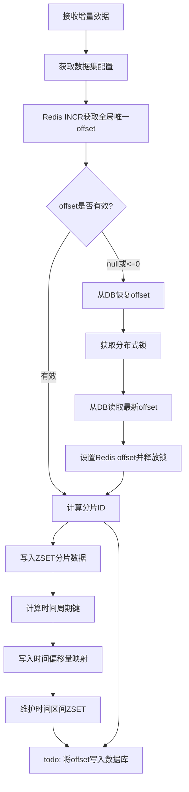
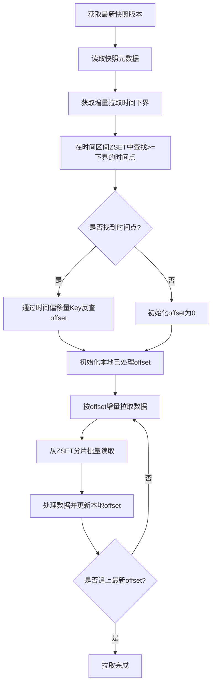
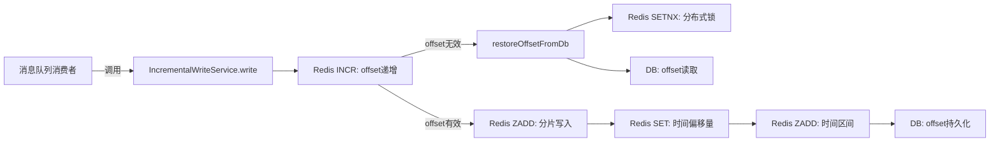

# 📋 系统功能现状调研报告

- **调研主题**：IncrementalWriteService#write 增量写入逻辑梳理 — 去除DB依赖、纯Redis化改造与时间回溯能力分析
- **涉及仓库**：hlj-demo (`hlj-parent/hlj-client`)
- **输入方式**：一句话触发
- **生成时间**：2026-07-28 18:03:50

------

## 📊 一、调研概述

- **一句话总结**：梳理增量数据写入服务 `IncrementalWriteService#write` 的完整执行逻辑，分析去除数据库依赖（纯Redis化）和时间回溯能力的现状与差距
- **业务背景**：当前增量写入流程中 offset 恢复依赖数据库（`restoreOffsetFromDb`），且 offset 持久化到数据库的代码尚未实现（标注为 todo）。目标是完全去除外部DB依赖，仅用Redis实现offset管理与数据写入，并支持基于时间的回溯查询
- **核心关注范围**：
  - offset 生成与恢复机制（当前依赖DB的恢复路径）
  - 增量数据分片写入逻辑（ZSET分片）
  - 时间索引构建与回溯能力
  - DB依赖点识别与去除方案评估
  - offset 持久化与Redis可靠性保障

------

## 🔄 二、系统功能现状流程图

> 基于代码实际执行逻辑梳理的系统业务流程。

### 场景1：增量数据写入流程（IncrementalWriteService#write）

#### （1）业务流程现状



> **图例说明**：`[]` 为业务操作节点，`{{}}` 为判断/分支节点。

#### （2）流程节点说明

| 流程节点 | 对应代码 | 实现方式 | 现状说明 |
| -------- | -------- | -------- | -------- |
| 接收增量数据 | `IncrementalWriteService.write(data, datasetName)` | 方法入参 | ✅已实现 |
| 获取数据集配置 | `SnapshotGlobalConfig.instanceIncrementalConfig()` | Spring配置注入 | ✅已实现 |
| Redis INCR获取全局唯一offset | `redisTemplate.opsForValue().increment(offsetKey)` | Redis原子操作 | ✅已实现 |
| offset有效性判断 | `if (offset == null \|\| offset <= 0)` | 条件分支 | ✅已实现 |
| 从DB恢复offset | `restoreOffsetFromDb(datasetName, offsetKey)` | 分布式锁+DB查询 | ⚠️部分实现 — DB读取代码已注释，硬编码返回1 |
| 计算分片ID | `(offset - 1) / maxMembersSize` | 整数除法 | ✅已实现 |
| 写入ZSET分片数据 | `redisTemplate.opsForZSet().add(zsetKey, data, offset)` | Redis ZADD | ✅已实现 |
| 写入时间偏移量映射 | `redisTemplate.opsForValue().set(timeOffset, offset)` | Redis SET | ✅已实现 |
| 维护时间区间ZSET | `redisTemplate.opsForZSet().add(timePeriodKey, ...)` + 溢出裁剪 | Redis ZADD+ZREMRANGEBYRANK | ✅已实现 |
| 将offset写入数据库 | `// 6. todo 将 offset 写入数据库` | 未实现 | ❌未实现 — 仅注释占位 |

#### （3）关键业务规则

- offset通过Redis INCR原子递增，保证全局唯一性
- 分片策略：每 `maxMembersSize`（默认10）条数据为一个ZSET分片，shardId = (offset-1) / maxMembersSize
- 时间索引按 `time2OffsetInterval`（默认60秒）周期构建，支持时间→offset的反查
- 时间区间ZSET保留最近 `maxMembersSize` 个时间点，超出部分按score裁剪最早记录
- 所有Redis Key均设置TTL（`ttlSeconds`），过期自动清理
- offset恢复时使用分布式锁（`lock:offset:init:{datasetName}`，10秒超时），防止并发重复初始化

### 场景2：时间回溯查询流程（IncrementLoadToMemoryService）

#### （1）业务流程现状



#### （2）流程节点说明

| 流程节点 | 对应代码 | 实现方式 | 现状说明 |
| -------- | -------- | -------- | -------- |
| 获取最新快照版本 | `redisTemplate.opsForValue().get(latestKey)` | Redis GET | ✅已实现 |
| 读取快照元数据 | `new Gson().fromJson(metaJson, SnapshotMetadata.class)` | Redis GET+反序列化 | ✅已实现 |
| 时间区间查找 | `redisTemplate.opsForZSet().rangeByScore(timePeriodKey, lowerBound, MAX)` | Redis ZRANGEBYSCORE | ✅已实现 |
| 时间反查offset | `redisTemplate.opsForValue().get(timeOffsetKey)` | Redis GET | ✅已实现 |
| 按offset增量拉取 | `pullIncrementalByOffset()` | while循环+ZSET范围查询 | ✅已实现 |

#### （3）关键业务规则

- 时间回溯起点由全量快照元数据中的 `incrPullTimeLowerBound` 决定
- 时间区间ZSET按score排序，`rangeByScore` 查找>=下界的第一个时间点
- 增量拉取按批次（`PULL_BATCH_SIZE=300`）循环读取，直到追上最新offset
- 本地offset使用 `AtomicLong` 保证线程安全，存储在 `ConcurrentHashMap` 中

------

## 🏗️ 三、仓库代码现状

### 仓库1：hlj-demo

#### （1）项目结构概览

```
hlj-parent/hlj-client/src/main/java/com/healerjean/proj/hotcache/
├── incr/
│   ├── IncrementalWriteService.java
│   └── IncrementalLuaWriteService.java
├── config/
│   ├── DatasetIncrementalConfig.java
│   ├── IncrementalExecutionConfig.java
│   └── SnapshotGlobalConfig.java
├── enums/
│   └── SnapshotPathEnum.java
├── service/pull/
│   └── IncrementLoadToMemoryService.java
└── model/
    ├── IncrementMetadata.java
    └── SnapshotMetadata.java
```

#### （2）功能实现映射

| 关注点 | 对应代码位置 | 实现状态 | 说明 |
| ------ | ------------ | -------- | ---- |
| offset原子递增 | `IncrementalWriteService.write()` L55 | ✅已实现 | Redis INCR保证原子性 |
| offset DB恢复 | `IncrementalWriteService.restoreOffsetFromDb()` L79 | ⚠️部分实现 | DB读取代码已注释，硬编码返回1 |
| offset DB持久化 | `IncrementalWriteService.write()` L60/L74 | ❌未实现 | 仅todo注释占位，出现2处 |
| ZSET分片写入 | `IncrementalWriteService.write()` L63-67 | ✅已实现 | 按offset分片，score=offset |
| 时间索引构建 | `IncrementalWriteService.write()` L69-77 | ✅已实现 | 时间→offset映射+时间区间ZSET |
| 时间回溯查询 | `IncrementLoadToMemoryService.pullIncrementalByLowerBound()` | ✅已实现 | 基于时间下界定位起始offset |
| Lua原子写入 | `IncrementalLuaWriteService.write()` | ✅已实现 | Lua脚本替代多次Redis调用 |
| 分布式锁 | `IncrementalWriteService.restoreOffsetFromDb()` L81 | ✅已实现 | SETNX+10s超时 |

#### （3）核心类/组件清单

| 类/组件名 | 路径 | 职责 | 与关注范围关联度 |
| --------- | ---- | ---- | ---------------- |
| `IncrementalWriteService` | `incr/IncrementalWriteService.java` | 增量数据写入（非原子版） | 🔴强关联 |
| `IncrementalLuaWriteService` | `incr/IncrementalLuaWriteService.java` | 增量数据写入（Lua原子版） | 🔴强关联 |
| `IncrementLoadToMemoryService` | `service/pull/IncrementLoadToMemoryService.java` | 增量数据拉取与时间回溯 | 🔴强关联 |
| `DatasetIncrementalConfig` | `config/DatasetIncrementalConfig.java` | 增量配置项（分片大小/TTL/时间间隔） | 🔴强关联 |
| `IncrementalExecutionConfig` | `config/IncrementalExecutionConfig.java` | 增量运行时配置+时间周期计算 | 🔴强关联 |
| `SnapshotPathEnum` | `enums/SnapshotPathEnum.java` | Redis Key路径模板枚举 | 🟡中等 |
| `SnapshotGlobalConfig` | `config/SnapshotGlobalConfig.java` | 全局配置管理+配置实例化 | 🟡中等 |

------

## 📡 四、接口现状

### （1）已有接口清单

| 序号 | 接口名 | 请求方式 | 路径 | 功能 | 与关注范围关联 |
| ---- | ------ | -------- | ---- | ---- | -------------- |
| 1 | `IncrementalWriteService.write()` | 内部调用 | `incr/IncrementalWriteService.java` | 增量数据写入 | 🔴强关联 |
| 2 | `IncrementalLuaWriteService.write()` | 内部调用 | `incr/IncrementalLuaWriteService.java` | Lua原子增量写入 | 🔴强关联 |
| 3 | `IncrementLoadToMemoryService.pullIncrementalByLowerBound()` | 内部调用 | `service/pull/IncrementLoadToMemoryService.java` | 时间驱动增量拉取 | 🔴强关联 |
| 4 | `IncrementLoadToMemoryService.pullIncrementalByOffset()` | 内部调用 | `service/pull/IncrementLoadToMemoryService.java` | Offset驱动增量拉取 | 🟡中等 |

### （2）接口详情（强关联接口）

#### 接口1：IncrementalWriteService.write()

**基本信息**
- **路径**：`IncrementalWriteService.write(String data, String datasetName)`
- **功能**：将增量数据写入Redis，维护offset、分片ZSET和时间索引

**请求参数**

| 参数名 | 类型 | 必填 | 说明 | 示例 |
| ------ | ---- | ---- | ---- | ---- |
| data | String | 是 | 增量数据JSON字符串 | `'{"userId":"u1","tag":"vip"}'` |
| datasetName | String | 是 | 数据集名称 | `"user_tag"` |

**响应参数**

无返回值（void）

------

## 💾 五、数据现状

### （1）已有数据模型

| 表/模型名 | 核心字段 | 与关注范围关联 | 说明 |
| --------- | -------- | -------------- | ---- |
| `DatasetIncrementalConfig` | maxMembersSize, ttlSeconds, time2OffsetInterval, dbSaveOffsetInterval | 🔴强关联 | 增量配置项，控制分片/TTL/时间间隔 |
| `IncrementMetadata` | datasetName, latestOffset, config | 🟡中等 | 增量元数据，含最新offset |
| `SnapshotMetadata` | datasetName, version, incrPullTimeLowerBound | 🟡中等 | 快照元数据，含增量拉取时间下界 |

### （2）缓存设计

| 缓存Key | 结构 | 用途 | 与关注范围关联 |
| ------- | ---- | ---- | -------------- |
| `{dataset}:incr:latestOffset` | String (INCR) | 全局唯一offset递增 | 🔴强关联 |
| `{dataset}:incr:shard:{shardId}` | ZSET (score=offset) | 增量数据分片存储 | 🔴强关联 |
| `{dataset}:incr:timePeriod` | ZSET (score=时间戳) | 时间区间索引 | 🔴强关联 |
| `{dataset}:incr:timeOffset:{time}` | String | 时间→offset映射 | 🔴强关联 |
| `lock:offset:init:{dataset}` | String (SETNX) | offset初始化分布式锁 | 🟡中等 |

------

## 🔗 六、依赖与调用链路

### （1）调用链路图



### （2）依赖清单

| 依赖项 | 类型 | 来源 | 用途 | 与关注范围关联 | 风险评估 |
| ------ | ---- | ---- | ---- | -------------- | -------- |
| Redis INCR | Redis | 自建 | offset原子递增 | 🔴强关联 | 🟡Redis故障时offset丢失无持久化 |
| Redis ZSET | Redis | 自建 | 分片数据存储+时间区间索引 | 🔴强关联 | 🟢TTL自动过期，可控 |
| DB (offsetRepository) | DB | 外部 | offset恢复与持久化 | 🔴强关联 | 🔴代码未实现，是去除目标 |
| Redis SETNX | Redis | 自建 | offset初始化分布式锁 | 🟡中等 | 🟢10s超时，安全 |

------

## ⚠️ 七、差距与风险评估

### （1）差距清单

| 序号 | 差距项 | 关注期望 | 系统现状 | 差距类型 | 风险等级 | 建议措施 |
| ---- | ------ | -------- | -------- | -------- | -------- | -------- |
| 1 | offset DB恢复依赖 | 纯Redis，无DB依赖 | `restoreOffsetFromDb()` 依赖DB读取offset，代码已注释但框架仍在 | 🔧需改造 | 🔴高 | 去除`restoreOffsetFromDb`中的DB逻辑，offset首次INCR返回1即为起始，无需恢复 |
| 2 | offset DB持久化 | 纯Redis，无DB依赖 | 2处todo注释`// 6. todo 将 offset 写入数据库`，未实现 | 🔧需改造 | 🟢低 | 直接删除todo注释，无需实现DB持久化 |
| 3 | offset Redis持久化保障 | Redis重启后offset不丢失 | 当前Redis INCR的key无显式持久化配置，Redis重启offset归零 | 🆕缺失 | 🔴高 | 对offsetKey设置TTL或配置Redis RDB/AOF持久化；或在时间索引中记录最大offset作为恢复源 |
| 4 | 时间回溯精度 | 支持任意时间点回溯 | 时间索引按`time2OffsetInterval`（默认60s）周期构建，仅能回溯到周期起始点 | 🔧需改造 | 🟡中 | 缩小`time2OffsetInterval`可提升精度，或记录每条数据的写入时间戳 |
| 5 | 时间区间ZSET溢出裁剪 | 保留足够时间窗口支持回溯 | 当前`maxMembersSize`（默认10）同时控制时间区间ZSET大小，回溯窗口过窄 | 🔧需改造 | 🟡中 | 时间区间ZSET的保留数量应独立配置，不与数据分片大小耦合 |
| 6 | offset恢复的纯Redis方案 | Redis故障恢复后能重建offset | 无纯Redis的offset恢复机制，`restoreOffsetFromDb`是唯一恢复路径 | 🆕缺失 | 🔴高 | 利用时间区间ZSET中的最大时间点反查最大offset，实现纯Redis恢复 |
| 7 | 分布式锁异常处理 | 锁获取失败有重试/降级策略 | 锁获取失败直接抛RuntimeException，无重试 | 🔧需改造 | 🟡中 | 增加有限次重试或降级策略（如等待短暂时间后重试） |

### （2）风险等级说明

| 风险等级 | 定义 | 示例 |
| -------- | ---- | ---- |
| 🔴 高风险 | 核心功能完全缺失，或改造涉及核心链路变更 | offset Redis持久化缺失、纯Redis恢复方案缺失 |
| 🟡 中风险 | 部分功能已有但需较大改造，或涉及跨仓库协调 | 时间回溯精度不足、时间区间保留策略耦合 |
| 🟢 低风险 | 已有功能可直接复用，仅需少量适配 | DB持久化todo直接删除即可 |
| ⚪ 无风险 | 已有功能完全满足需求 | ZSET分片写入、时间索引构建 |

------

## 📎 八、知识缺口与待确认项

| 序号 | 缺口项 | 影响范围 | 建议确认方式 |
| ---- | ------ | -------- | ------------ |
| 1 | Redis的RDB/AOF持久化策略是否已配置 | offset可靠性保障 | 需与运维确认Redis实例的持久化配置 |
| 2 | `maxMembersSize`是否允许独立于数据分片大小单独配置时间区间保留数量 | 时间回溯窗口大小 | 需与业务确认回溯时间窗口需求 |
| 3 | `dbSaveOffsetInterval`配置项（默认5）在去除DB后是否需要保留或替换语义 | 配置清理 | 需确认该配置项是否有其他使用方 |
| 4 | `IncrementalLuaWriteService`中的Lua脚本是否也需要同步去除DB恢复逻辑 | Lua版写入服务 | 需确认Lua版是否为生产使用版本 |
| 5 | offset恢复场景的触发频率 — Redis INCR在key不存在时返回1，实际是否会出现offset<=0的情况 | 恢复逻辑必要性 | 需分析Redis INCR的返回值语义 |

------

## 📝 九、行动建议（优先级排序）

| 优先级 | 行动项 | 类型 | 涉及仓库 | 依赖项 | 预估工作量 |
| ------ | ------ | ---- | -------- | ------ | ---------- |
| P0 | 实现纯Redis offset恢复方案：利用时间区间ZSET的最大时间点反查最大offset，替代`restoreOffsetFromDb` | 🔧改造 | hlj-demo | 无 | 1d |
| P0 | 去除`restoreOffsetFromDb`中的DB依赖逻辑，简化为纯Redis恢复或直接使用INCR返回值 | 🔧改造 | hlj-demo | P0第一项 | 0.5d |
| P1 | 对offsetKey增加TTL或确保Redis持久化配置，保障Redis重启后offset可恢复 | 🔧改造 | hlj-demo | 需运维确认Redis配置 | 0.5d |
| P1 | 删除2处`// 6. todo 将 offset 写入数据库`注释及`dbSaveOffsetInterval`配置项 | 🔧改造 | hlj-demo | 无 | 0.5d |
| P1 | 将时间区间ZSET保留数量与`maxMembersSize`解耦，新增独立配置项如`timePeriodRetainSize` | 🔧改造 | hlj-demo | 无 | 0.5d |
| P2 | 同步改造`IncrementalLuaWriteService`，去除DB恢复逻辑 | 🔧改造 | hlj-demo | P0完成 | 0.5d |
| P2 | 为分布式锁增加有限次重试机制 | 🔧改造 | hlj-demo | 无 | 2h |

> **优先级定义**：P0 = 阻塞主流程，必须优先完成；P1 = 核心功能，需在P0后跟进；P2 = 优化项，可延后。