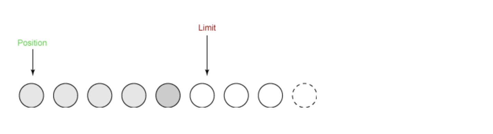
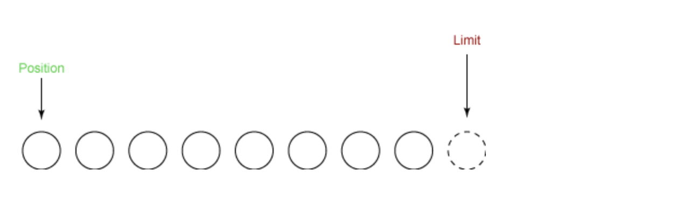

<!-- image url 
https://raw.githubusercontent.com/HealerJean123/HealerJean123.github.io/master/blogImages
　　首行缩进
<font color="red">  </font>
-->

## 前言
　　NIO即新的输入输出，这个库是在JDK1.4中才引入的。它在标准java代码中提供了高速的面向块的IO操作。NIO即New IO，NIO和IO有相同的作用和目的，但实现方式不同，NIO主要用到的是块，所以NIO的效率要比IO高很多。
　　<br/>
　　NIO和IO最大的区别是数据打包和传输方式。IO是以流的方式处理数据，而NIO是以块的方式处理数据。
　　
　　在Java API中提供了两套NIO，一套是针对标准输入输出NIO，另一套就是网络编程NIO，
		
本篇主要介绍 标准NIO


## Buffer


　　Buffer是一个对象，它包含一些要写入或读出的数据。在NIO中，数据是放入buffer对象的，而在IO中，数据是直接写入或者读到Stream对象的。应用程序不能直接对 Channel 进行读写操作，而必须通过 Buffer 来进行，<font color="red">  **即 Channel 是通过 Buffer 来读写数据的。**</font>


　　当向 Buffer 写入数据时，Buffer 会记录下写了多少数据。一旦要读取数据，需要通过 **`flip() `**方法将 Buffer **`从写模式切换到读模式`**。在读模式下，可以读取之前写入到 Buffer 的所有数据。
　　一旦读完了所有的数据，就需要清空缓冲区，让它可以再次被写入。有两种方式能清空缓冲区：调用` clear() `或 `compact()` 方法。`clear() `方法会清空整个缓冲区。`compact()` 方法只会清除已经读过的数据。任何未读的数据都被移到缓冲区的起始处，新写入的数据将放到缓冲区未读数据的后面。
　　
## Channel

　　Channel是一个对象，可以通过它读取和写入数据。可以把它看做IO中的流。但是它和流相比还有一些不同：
　　1、Channel是双向的，既可以读又可以写，而流是单向的
　　2、	Channel可以进行异步的读写
　　3、	对Channel的读写必须通过buffer对象
　　
　　正如上面提到的，所有数据都通过Buffer对象处理，所以，您永远不会将字节直接写入到Channel中，相反，您是将数据写入到Buffer中；

　　同样，您也不会从Channel中读取字节，而是将数据从Channel读入Buffer，再从Buffer获取这个字节。

　　在Java NIO中Channel主要有如下几种类型：

`FileChannel`：从文件读取数据的
`DatagramChannel`：读写UDP网络协议数据
`ServerSocketChannel`：可以监听TCP连接
`SocketChannel`：读写TCP网络协议数据

## 1、读取数据

### 原理 ：在NIO系统中，任何时候执行一个读操作，不是直接从Channel中读取数据，因为所有的数据都必须用Buffer来封装，所以您应该是从Channel读取数据到Buffer。


```	
  1、	从FileInputStream获取Channel
  2、	创建Buffer
  3、	从Channel读取数据到Buffer
```

第一步：获取通道

```
FileInputStream fin = new FileInputStream( "readandshow.txt" );
FileChannel fc = fin.getChannel(); 
```

第二步：创建缓冲区

```
ByteBuffer buffer = ByteBuffer.allocate( 1024 );
```
	
第三步：将数据从通道读到缓冲区

```
fc.read( buffer );

```

## 2、写入数据到文件

类似于从文件读数据， 
第一步：获取一个通道

```
FileOutputStream fout = new FileOutputStream( "writesomebytes.txt" );
FileChannel fc = fout.getChannel();
```

第二步：创建缓冲区，将数据放入缓冲区

```
ByteBuffer buffer = ByteBuffer.allocate( 1024 );

for (int i=0; i<message.length; ++i) {
 buffer.put( message[i] );
}
buffer.flip(); //切换buffe到读模式，这样才能被channel读取并且写入到文件中
```

第三步：把缓冲区数据写入通道中

```
fc.write( buffer );

```

## 3、读写结合


```
**
 * 用java NIO api拷贝文件
 * @param src
 * @param dst
 * @throws IOException
 */
public static void copyFileUseNIO(String src,String dst) throws IOException{
    //声明源文件和目标文件
            FileInputStream fi=new FileInputStream(new File(src));
            FileOutputStream fo=new FileOutputStream(new File(dst));
            //获得传输通道channel
            FileChannel inChannel=fi.getChannel();
            FileChannel outChannel=fo.getChannel();
            //获得容器buffer
            ByteBuffer buffer=ByteBuffer.allocate(1024);
            while(true){
                //判断是否读完文件
                int eof =inChannel.read(buffer);
                if(eof==-1){
                    break;  
                }
                //重设一下buffer的position=0，limit=position
                buffer.flip();
                //开始写
                outChannel.write(buffer);
                //写完要重置buffer，重设position=0,limit=capacity
                buffer.clear();
            }
            inChannel.close();
            outChannel.close();
            fi.close();
            fo.close();
}     
```

## 4、解释一下奇怪的方法

### 4.1、fcin.read( buffer ); 检查状态

　　当没有更多的数据时，拷贝就算完成，此时 read() 方法会返回 -1 ，我们可以根据这个方法判断是否读完。
	
```
int r= fcin.read( buffer );
if (r==-1) {
     break;
     }

```
### 4.2、buffer.flip()、clear(); 切换到读取模式

控制buffer状态的三个变量
　　position：跟踪已经写了多少数据或读了多少数据，它指向的是下一个字节来自哪个位置<br/>
　　limit：代表还有多少数据可以取出或还有多少空间可以写入，它的值小于等于capacity。<br/>
　　capacity：代表缓冲区的最大容量，一般新建一个缓冲区的时候，limit的值和capacity的值默认是相等的。<br/>
　　
<font color="red">flip、clear这两个方法便是用来设置这些值的。</font>


1、flip() 源码

```
public final Buffer flip() {
    limit = position;
    position = 0;
    mark = -1;
    return this;
 }
```
　　写入数据之前我们调用了buffer.flip();方法，这个方法把当前的指针位置position设置成了limit，再将当前指针position指向数据的最开始端，<br/>
　　我们现在可以将数据从缓冲区写入通道了。 position 被设置为 0，这意味着我们得到的下一个字节是第一个字节。 limit 已被设置为原来的 position，这意味着它包括以前读到的所有字节，并且一个字节也不多。 这样就是度模式




2、clear


```
 public final Buffer clear() {
    position = 0;
    limit = capacity;
    mark = -1;
    return this;
}
```

　　写入数据之后也就是读数据之前，我们调用了 buffer.clear();方法，这个方法重设缓冲区以便接收更多的字节。下图显示了在调用 clear() 后缓冲区的状态。




<br/><br/><br/>
如果满意，请打赏博主任意金额，感兴趣的请下方留言吧。可与博主自由讨论哦

|支付包 | 微信|微信公众号|
|:-------:|:-------:|:------:|
| | ||


<!-- Gitalk 评论 start  -->

<link rel="stylesheet" href="https://unpkg.com/gitalk/dist/gitalk.css">
<script src="https://unpkg.com/gitalk@latest/dist/gitalk.min.js"></script> 
<div id="gitalk-container"></div>    
 <script type="text/javascript">
    var gitalk = new Gitalk({
		clientID: `1d164cd85549874d0e3a`,
		clientSecret: `527c3d223d1e6608953e835b547061037d140355`,
		repo: `HealerJean123.github.io`,
		owner: 'HealerJean123',
		admin: ['HealerJean123'],
		id: '3JDirHHoDc2c1Ys3',
    });
    gitalk.render('gitalk-container');
</script> 

<!-- Gitalk end -->

