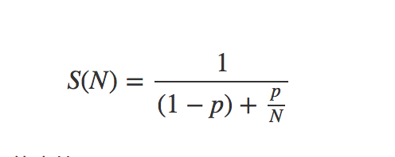

<!-- image url 
https://raw.githubusercontent.com/HealerJean123/HealerJean123.github.io/master/blogImages
　　首行缩进
<font color="red">  </font>
-->

## 前言

线程数量过小，可能导致无法充分利用处理器资源；线程数也不宜过大，线程数过大会增加上下文切换以及其他开销。

在这个之前我们先了解下cpu与线程的关系


```
线程是cpu处理机时间资源的基本单位，其实是一回事的样子

（1） 第一阶段，单CPU时代，单CPU在同一时间点，只能执行单一线程。比如，的某一刻00:00:00 这一秒，只计算1＋1=2（假设cpu每秒计算一次）

（2） 第二阶段，单CPU多任务阶段，计算机在同一时间点，并行执行多个线程。但这并非真正意义上的同时执行，而是多个任务共享一个CPU，操作系统协调CPU在某个时间点，执行某个线程，因为CPU在线程之间切换比较快，给人的感觉，就好像多个任务在同时运行。比如，电脑开了两个程序qq和qq音乐，假设这两个程序都只有一个线程。人能够感觉到CPU切换的频率是一秒一次，假设当前cpu计算速度是1秒1次，那么我们就能明显感到卡顿，当聊天，点击发送按钮时候，qq音乐就会停止运行。当前cpu计算速度是1秒100次，也就是它能在一秒之内在这两个进程见切换100次，那么我们就感不到卡顿，觉得QQ和QQ音乐是同时在运行。

（3） 第三阶段，多CPU多任务阶段，真正实现的，在同一时间点运行多个线程。具体到哪个线程在哪个CPU执行，这就跟操作系统和CPU本身的设计有关了。


```
	


## 1、阿姆达尔定律（Amdahl's law）

定律描述了线程数与多线程程序相对于单线程程序的提速之间的关系，在一个时刻上，一个处理器上一个时刻只能运行一个线程的情况下，处理器的数量就等于并行线程的数量<br/>
设处理器数量为N
程序中必须串行（无法并发话）的部分占程序全部耗时的比率为P
那么将这样一个程序改为多线程程序，我们就能获得理论上的最大速度S(N)。




通过上面其实可以看到，当N趋于无穷大的时候，最终决定多线程程序提速的因素是整个计算机中串行部分的耗时比例P，而不是线程N，P越大提速越小，。因此为了让多线程能够获得最大额提速应该从算法入手，减少程序中串行的部分，不能仅仅依靠增加线程数量


## 2、线程数设置的原则

设置线程数量需要考虑一些实际的因素，系统的资源状况（处理器的数目，内存容量）、线程所执行任务的特性（cpu密集型，i/o密集型） 资源使用情况（CPU使用率上限）

设计线程数要尽可能考虑其他所有进程内部线程数设置的情况。显然，这是不可能实现的，即使是一个项目中从一个模块来考虑该模块线程数量的值，要将该模块与其他模块的线程数设置情况考虑进来也不是一件容易的事情。因此，考虑线程数仅仅是为了避免随意设置，无法达到一个理想的值。

N<sub>cpu</sub> 表示一个系统处理机的数量，N<sub>cpu</sub> 可以通过下面的方法获取


```
 System.out.println(Runtime.getRuntime().availableProcessors());
```


* 对于CPU密集型线程，考虑到这类线程执行任务时消耗主要是处理器资源，我们可以将这类线程数设置为N<sub>cpu</sub>,有时候，因为CPU密集型线程也可能由于某些原因被切出，为了避免处理器资源浪费，可以为它添加一个额外的线程N<sub>cpu</sub>+1


* 对于I/O密集型线程，考虑到I/O操作可能导致上下文切换，为这样的线程设置过多的线程数会导致额外的系统开销，在I/O密集型线程在等待I/O操作返回结果的时候不占用处理器资源。因此我们可以为每个处理器安排一个额外的线程来提高处理器资源的利用率。所以设置为N<sub>cpu</sub>*2


```
public class NumMain {
    public static void main(String[] args) {
        //返回可用处理器的Java虚拟机的数量。
        //这个值可以在虚拟机中的某个调用过程中改变。应用程序是可用的处理器数量敏感，因此应该偶尔查询该属性，并适当调整自己的资源使用情况。

        //如果是CPU密集型任务，就需要尽量压榨CPU，参考值可以设为 NCPU+1
        //如果是IO密集型任务，参考值可以设置为2*NCPU
        //   一般情况下,CPU核心数 == 最大同时执行线程数.在这种情况下(设CPU核心数为n),大量客户端会发送请求到服务器,
        // 但是服务器最多只能同时执行n个线程.

        //设线程池工作队列长度为m,且m>>n,则此时会导致CPU频繁切换线程来执行(如果CPU使用的是FCFS,则不会频繁切换,
        // 如使用的是其他CPU调度算法,如时间片轮转法,最短时间优先,则可能会导致频繁的线程切换).

        //        1.1: CPU密集型:
        //
        //                例如,一般我们系统的静态资源,比如js,css等,会存在一个版本号,如 main.js?v0,每当用户访问这个资源的时候,会发送一个比对请求到服务端,比对本地静态文件版本和服务端的文件版本是否一致,不一致则更新.这种任务一般不占用大量IO,所以后台服务器可以快速处理,压力落在CPU上.
        //
        //        1.2: I/O密集型:
        //
        //                比方说近期我们做的万科CRM系统,常有大数据量的查询和批量插入操作,此时的压力主要在I/O上.
        System.out.println(Runtime.getRuntime().availableProcessors());


    }
}


```


实际使用：

excel导入几十万条数据的时候，先放到队列中，再保存到数据库中，其中开启两个线程池，每个线程池提供给NCPU。一边读取一边导入（读取队列中的）写入


<br/><br/><br/>
如果满意，请打赏博主任意金额，感兴趣的请下方留言吧。可与博主自由讨论哦

|支付包 | 微信|微信公众号|
|:-------:|:-------:|:------:|
| | ||


<!-- Gitalk 评论 start  -->

<link rel="stylesheet" href="https://unpkg.com/gitalk/dist/gitalk.css">
<script src="https://unpkg.com/gitalk@latest/dist/gitalk.min.js"></script> 
<div id="gitalk-container"></div>    
 <script type="text/javascript">
    var gitalk = new Gitalk({
		clientID: `1d164cd85549874d0e3a`,
		clientSecret: `527c3d223d1e6608953e835b547061037d140355`,
		repo: `HealerJean123.github.io`,
		owner: 'HealerJean123',
		admin: ['HealerJean123'],
		id: 'CMvk74zmrAv25pyb',
    });
    gitalk.render('gitalk-container');
</script> 

<!-- Gitalk end -->

