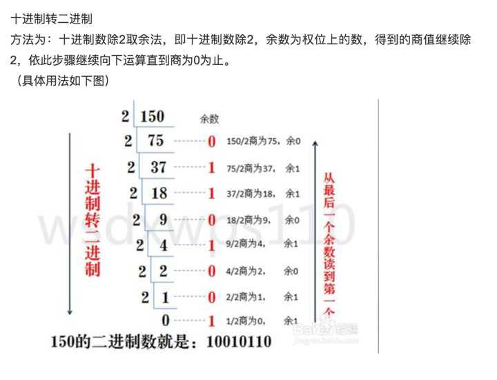
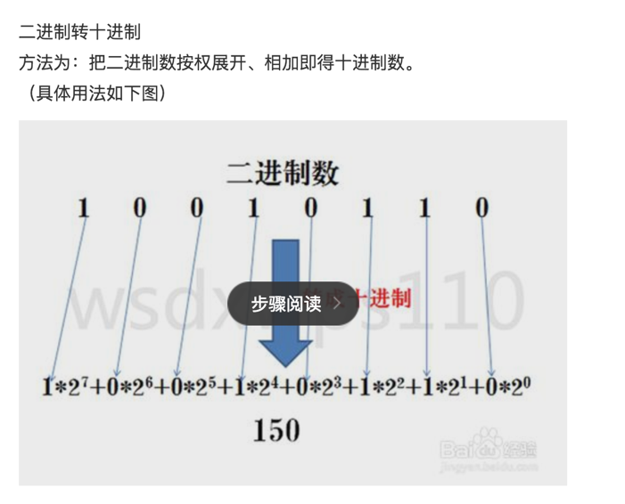
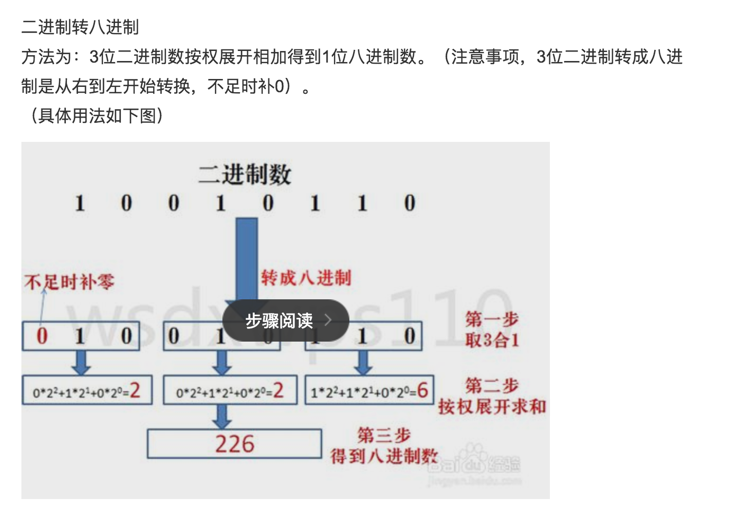

<!-- image url 
https://raw.githubusercontent.com/HealerJean/HealerJean.github.io/master/blogImages
　　首行缩进


<font  clalss="healerColor" color="red" size="5" >     

</font>

<font  clalss="healerSize"  size="5" >     </font>

-->

## 前言

#### [博主github](https://github.com/HealerJean)
#### [博主个人博客http://blog.healerjean.com](http://HealerJean.github.io)    


## 1、进制转化

一个字节为8位二进制位。    

字节:（Byte /bait/ n. [C]）是计算机信息技术用于计量存储容量的一种计量单位，也表示一些计算机编程语言中的数据类型和语言字符。   

位(bit):数据存储是以“字节”（Byte）为单位，数据传输是以大多是以“位”（bit，又名“比特”）为单位   

```java

1B（byte，字节）= 8 bit（位）；
一个位就代表一个0或1（即二进制）
```

### 1.1、10进制转2进制


  
### 1.2、二进制转10进制





### 1.3、二进制转8进制


  
 

```java
<< : 左移运算符，num << 1,相当于num乘以2  低位补0
>> : 右移运算符，num >> 1,相当于num除以2  高位补0
>>> : 无符号右移，忽略符号位，空位都以0补齐
 % : 模运算 取余
^ :   位异或 第一个操作数的的第n位于第二个操作数的第n位相反，那么结果的第n为也为1，否则为0
 & : 与运算 第一个操作数的的第n位于第二个操作数的第n位如果都是1，那么结果的第n为也为1，否则为0
 | :  或运算 第一个操作数的的第n位于第二个操作数的第n位 只要有一个是1，那么结果的第n为也为1，否则为0
 ~ : 非运算 操作数的第n位为1，那么结果的第n位为0，反之，也就是取反运算（一元操作符：只操作一个数）


```


   

    
     
     
     
     
     
     
     
     
<br><br>    
<font  color="red" size="5" >     
感兴趣的，欢迎添加博主微信
 </font>
<br>
哈，博主很乐意和各路好友交流，如果满意，请打赏博主任意金额，感兴趣的在微信转账的时候，备注您的微信或者其他联系方式。添加博主微信哦。    

请下方留言吧。可与博主自由讨论哦

|微信 | 微信公众号|支付宝|
|:-------:|:-------:|:------:|
| || |


<!-- Gitalk 评论 start  -->

<link rel="stylesheet" href="https://unpkg.com/gitalk/dist/gitalk.css">
<script src="https://unpkg.com/gitalk@latest/dist/gitalk.min.js"></script> 
<div id="gitalk-container"></div>    
 <script type="text/javascript">
    var gitalk = new Gitalk({
		clientID: `1d164cd85549874d0e3a`,
		clientSecret: `527c3d223d1e6608953e835b547061037d140355`,
		repo: `HealerJean.github.io`,
		owner: 'HealerJean',
		admin: ['HealerJean'],
		id: 'AAAAAAAAAAAAAAA',
    });
    gitalk.render('gitalk-container');
</script> 

<!-- Gitalk end -->

