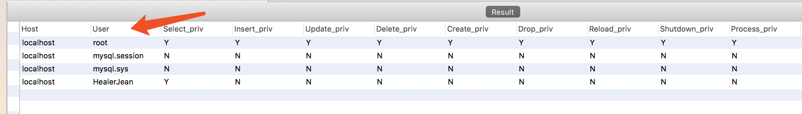

<!-- image url 
https://raw.githubusercontent.com/HealerJean123/HealerJean123.github.io/master/blogImages
-->

## 前言


> 如果想成为一个技术总监，技术经理。我觉得对于数据库用户的权限分配还是很重要的。比如，阿里巴巴，一个刚来的实习生，他可能连真实数据库都接触不到。等到终于熬成可以操作下数据库了，但是发现自己还是只有读取权限，并没有其他任何对数据库造成影响的权限。
	
---
> 这就是技术经理，技术总监。技术组长。所做的事情，维护好公司的利益，最为重要。

## 必须知道的权限有哪些

> 首先你看了肯定会头大，因为其实真正用到的并不会太多，<font color="red">而你关心的无非也就是增删改查权限，如果你是这么认为的，那么请你离开，我的博客不适合你</font>。你只适合干码农，从头到尾的敲代码


## 用户权限管理作用： 

1. 可以限制用户访问哪些库、哪些表 
2. 可以限制用户对哪些表执行CREATE、DELETE、(ALTER、UPDATE)、SELECT等操作 
3. 可以限制用户登录的IP或域名 
4. 可以限制用户自己的权限是否可以授权给别的用户


## 1、user表的组成

>   mysql中所有的用户都是存放在user表中的，user表有39个字段。这些字段可以分为4类：
	•	用户列；
	•	权限列；
	•	安全列；
	•	资源控制列；

### 1.1、用户列

>用户列包括Host、User、Password，
>　　User：要创建用户的名字。
　　Host：主机名：表示要这个新创建的用户允许从哪台机登陆
　　Password：新创建用户的登陆数据库密码，如果没密码可以不写。


### 1.1 查看数据库中所有的用户

```
muysql> select * form user
```



<br/><br/><br/>
如果满意，请打赏博主任意金额，感兴趣的请下方留言吧。可与博主自由讨论哦

|支付包 | 微信|微信公众号|
|:-------:|:-------:|:------:|
| | ||


<!-- Gitalk 评论 start  -->

<link rel="stylesheet" href="https://unpkg.com/gitalk/dist/gitalk.css">
<script src="https://unpkg.com/gitalk@latest/dist/gitalk.min.js"></script> 
<div id="gitalk-container"></div>    
 <script type="text/javascript">
    var gitalk = new Gitalk({
		clientID: `1d164cd85549874d0e3a`,
		clientSecret: `527c3d223d1e6608953e835b547061037d140355`,
		repo: `HealerJean123.github.io`,
		owner: 'HealerJean123',
		admin: ['HealerJean123'],
		id: 'AAAAAAAAAAAAAA',
    });
    gitalk.render('gitalk-container');
</script> 

<!-- Gitalk end -->

