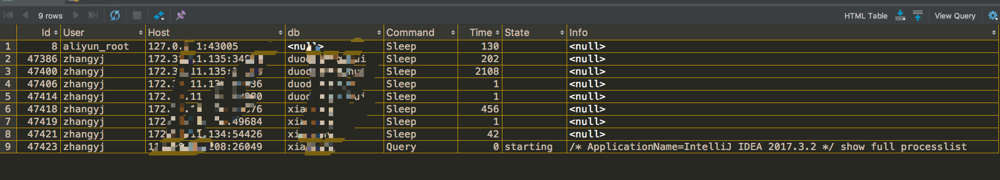

<!-- image url 
https://raw.githubusercontent.com/HealerJean/HealerJean.github.io/master/blogImages
　　首行缩进
<font color="red">  </font>
-->

## 前言

博主在使用使用大量定时器任务对数据库操作的时候，中间接到一个任务，需要直接对库里的字段进行修改，随性使用了一个alter table name drop column 命令结果卡主了。

卡主不要看，我们可以使用命令来看看到底是哪个操作卡主了，然后将它kill掉

## 1、卡死的时候杀死进程

### 1、开始，命令查看，是哪台服务器上运行了什么命令 

```sql
select id, db, user, host, command, time, state, info
from information_schema.processlist
where command != 'Sleep'
order by time desc ;

```


### 2、可以看到那个端口运行了命令和命令执行的开始时间，根据端口开始时间长的将它杀死

```sql
select * from information_schema.innodb_trx;


```


### 3、mysql 命令中直接执行即可杀死端口

```sql
	kill 29832；
```

## 2、mysql查看正在执行的sql


```sql
show full processlist;

下面的id为进程id

```



## 3、其他的配置

### 2.1、事物的隔离级别配置

```sql

set global transaction isolation level read uncommitted;
select @@global.tx_isolation;

set SESSION transaction isolation level read uncommitted;
select @@tx_isolation;


```


### 3.2、事物是否自动提交


```sql
show variables like '%autocommit%';

set autocommit = off;

```

### 3.3、存储引擎

#### 3.3.1、 展示存储引擎

```sql

SHOW  ENGINES  ;

mysql> SHOW  ENGINES  ;
+--------------------+---------+----------------------------------------------------------------+--------------+------+------------+
| Engine             | Support | Comment                                                        | Transactions | XA   | Savepoints |
+--------------------+---------+----------------------------------------------------------------+--------------+------+------------+
| InnoDB             | DEFAULT | Supports transactions, row-level locking, and foreign keys     | YES          | YES  | YES        |
| MRG_MYISAM         | YES     | Collection of identical MyISAM tables                          | NO           | NO   | NO         |
| MEMORY             | YES     | Hash based, stored in memory, useful for temporary tables      | NO           | NO   | NO         |
| BLACKHOLE          | YES     | /dev/null storage engine (anything you write to it disappears) | NO           | NO   | NO         |
| MyISAM             | YES     | MyISAM storage engine                                          | NO           | NO   | NO         |
| CSV                | YES     | CSV storage engine                                             | NO           | NO   | NO         |
| ARCHIVE            | YES     | Archive storage engine                                         | NO           | NO   | NO         |
| PERFORMANCE_SCHEMA | YES     | Performance Schema                                             | NO           | NO   | NO         |
| FEDERATED          | NO      | Federated MySQL storage engine                                 | NULL         | NULL | NULL       |
+--------------------+---------+----------------------------------------------------------------+--------------+------+------------+
9 rows in set (0.05 sec)
```

#### 3.3.2、查看数据库表的存储引擎


```sql
SHOW  CREATE  TABLE healerjean_comment ;


```

#### 3.3.3、修改表的存储引擎


```sql
alter TABLE  healerjean_comment ENGINE  = MyISAM ;

```


<br/><br/><br/>
如果满意，请打赏博主任意金额，感兴趣的在微信转账的时候，添加博主微信哦， 请下方留言吧。可与博主自由讨论哦

|支付包 | 微信|微信公众号|
|:-------:|:-------:|:------:|
| | ||


<!-- Gitalk 评论 start  -->

<link rel="stylesheet" href="https://unpkg.com/gitalk/dist/gitalk.css">
<script src="https://unpkg.com/gitalk@latest/dist/gitalk.min.js"></script> 
<div id="gitalk-container"></div>    
 <script type="text/javascript">
    var gitalk = new Gitalk({
		clientID: `1d164cd85549874d0e3a`,
		clientSecret: `527c3d223d1e6608953e835b547061037d140355`,
		repo: `HealerJean.github.io`,
		owner: 'HealerJean',
		admin: ['HealerJean'],
		id: 'IKxYRMpfrDyVHBqJ',
    });
    gitalk.render('gitalk-container');
</script> 

<!-- Gitalk end -->

