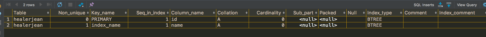

<!-- image url 
https://raw.githubusercontent.com/HealerJean123/HealerJean123.github.io/master/blogImages
　　首行缩进
<font color="red">  </font>
-->

## 前言

如果是小白的话，我觉得看到这篇文章一定会对博主赞赏有加，因为实在是太好了，没错，博主就是要让你喜欢上。

## 1、索引
索引是表的目录，在查找内容之前可以先在目录中查找索引位置，以此快速定位查询数据。对于索引，会保存在额外的文件中。
2、索引，是数据库中专门用于帮助用户快速查询数据的一种数据结构。类似于字典中的目录，查找字典内容时可以根据目录查找到数据的存放位置，然后直接获取即可。

## 2、索引优缺点
#### 2.1、优点

索引由数据库中一列或多列组合而成，其作用是提高对表中数据的查询速度
索引的优点是可以提高检索数据的速度
#### 2.2、缺点

索引的缺点是创建和维护索引需要耗费时间
索引可以提高查询速度，会减慢写入速度

## 3、索引分类


### 1.普通索引，<font color="red">仅加速查询  </font>
### 2.唯一索引，<font color="red">加速查询 + 列值唯一（可以有null）</font>
### 3.全文索引，<font color="red">对文本的内容进行分词，进行搜索</font>
### 4.单列索引，<font color="red"></font>
### 5.多列索引，<font color="red"></font>
### 6.空间索引，<font color="red"></font>
### 7.主键索引，<font color="red">加速查询 + 列值唯一 +　表中只有一个（不可以有null）</font>
### 8.组合索引，<font color="red">多列值组成一个索引，专门用于组合搜索，其效率大于索引合并，</font>


索引合并，使用多个单列索引组合搜索
覆盖索引，select的数据列只用从索引中就能够取得，不必读取数据行，换句话说查询列要被所建的索引覆盖


## 1、普通索引

### 1.1.1、创建表的时候同事创建索引


```
create table healerjean (
  id   bigint(20)  NOT NULL AUTO_INCREMENT PRIMARY KEY COMMENT  '主键',
  name  VARCHAR(32) NOT NULL COMMENT '姓名',
  email VARCHAR(64) NOT NULL COMMENT  '邮箱',
  message text DEFAULT  NULL COMMENT '个人信息',
  INDEX index_name (name) COMMENT '索引name'
) COMMENT  = '索引测试表';

```

### 1.1.2、在存在的表上创建索引

```
create index index_name on healerjean(name)

```
### 1.1.3、注意：
<font color="red">对于创建索引时如果是blob 和 text 类型，必须指定length。
 </font>
```
create index ix_extra on in1(message(200));

```

### 1.2、删除索引


```
drop index_name on healerjean;

```

### 1.3、查看索引

这个时候，我们会发现其实主键id也是一个索引
```
show index from healerjean;

```




## 2、主键索引 （我们一般都会提供主键的，默认主键就是索引）


## 3、正确使用索引
文章相当出色，请查看。

[https://www.cnblogs.com/Cheney222/articles/5876382.html](https://www.cnblogs.com/Cheney222/articles/5876382.html)

### <font color="red">如果以错误的方式使用，则即使建立索引也会不奏效。
 </font>


<br/><br/><br/>
如果满意，请打赏博主任意金额，感兴趣的在微信转账的时候，添加博主微信哦， 请下方留言吧。可与博主自由讨论哦

|支付包 | 微信|微信公众号|
|:-------:|:-------:|:------:|
| | ||


<!-- Gitalk 评论 start  -->

<link rel="stylesheet" href="https://unpkg.com/gitalk/dist/gitalk.css">
<script src="https://unpkg.com/gitalk@latest/dist/gitalk.min.js"></script> 
<div id="gitalk-container"></div>    
 <script type="text/javascript">
    var gitalk = new Gitalk({
		clientID: `1d164cd85549874d0e3a`,
		clientSecret: `527c3d223d1e6608953e835b547061037d140355`,
		repo: `HealerJean123.github.io`,
		owner: 'HealerJean123',
		admin: ['HealerJean123'],
		id: '1dv6t962CQpD2HWt',
    });
    gitalk.render('gitalk-container');
</script> 

<!-- Gitalk end -->

