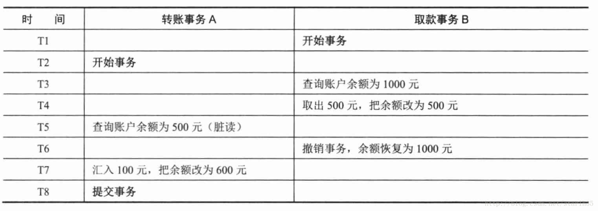

<!-- image url 
https://raw.githubusercontent.com/HealerJean123/HealerJean123.github.io/master/blogImages
　　首行缩进
<font color="red">  </font>
-->

## 前言

## 事务的并发问题

### 1、脏读：

事务A读取了事务B更新的数据，然后B回滚操作，那么A读取到的数据是脏数据，

#### 举例：当一个事务读取其它完成一半事务的记录时，就会发生脏读取。例如：用户A,B看到的值都是6，用户B把值改为2，用户A读到的值仍为6。

### 2、不可重复读：

事务 A 多次读取同一数据，事务 B 在事务A多次读取的过程中，对数据作了更新并提交，导致事务A多次读取同一数据时，结果 不一致。

### 3、幻读：

系统管理员A将数据库中所有学生的成绩从具体分数改为ABCDE等级，但是系统管理员B就在这个时候插入了一条具体分数的记录，当系统管理员A改结束后发现还有一条记录没有改过来，就好像发生了幻觉一样，这就叫幻读。


|事务隔离级别|脏读|不可重复读|幻读|
|----|----|----|----|
|读取未提交内容（read-uncommitted）|是|是|是|
|读取提交内容（不可重复读）（read-committed）|否|是|是|
|可重复读（repeatable-read）|否|否|是|
|串行化（serializable）|否|否|否|


## 1、事物的隔离级别

#### 1.1、查看事物的隔离级别

```
SELECT @@tx_isolation ;  #myslq 默认隔离级别 ，REPEATABLE-READ，但是我们建议改为不可重复读级别

```

#### 1.2、设置事物的隔离级别


```
SET  SESSION  transaction ISOLATION LEVEL  READ UNCOMMITTED  ;
```


### 1： read uncommitted（脏读,读取正在进行中的数据，毫无意义，所以脏）

事务A对数据进行修改，但未提交。此时开启事务B，在事务B中能读到事务A中对数据库进行的未提交数据的修改。<font color="red">  （这种方式也称为脏读）</font>




#### 1.1、举例测试


```
CREATE TABLE  transaction_account (

  id bigint(20)  NOT NULL AUTO_INCREMENT primary key,
  name varchar(20) default null COMMENT '名称',
  balance bigint(20) default 0 COMMENT '金额'
)

```

#### 1、打开一个客户端A，并设置当前事务模式为read uncommitted（未提交读），查询表account的初始值：


#### 2、在客户端A的事务提交之前，打开另一个客户端B，更新表account：


#### 3、这时，虽然客户端B的事务还没提交，但是客户端A就可以查询到B已经更新的数据：


#### 4、一旦客户端B的事务因为某种原因回滚，所有的操作都将会被撤销，那客户端A查询到的数据其实就是脏数据：


#### 5、在客户端A执行更新语句update account set balance = balance - 50 where id =1，lilei的balance没有变成350，居然是400，是不是很奇怪，数据不一致啊<font color="red">  如果你这么想就太天真 了，在应用程序中，我们会用400-50=350，并不知道其他会话回滚了，要想解决这个问题可以采用读已提交的隔离级别</font>，


### 2 ：read committed

打开事物A，打开事物B，事物B中对数据库进行修改，但未提交，此时事物A不能查看到事物B对数据库表的修改，此时事物提交事物B,则事物A可以查看到事物B对数据库的修改。因此，再事物A中，对于数据库查询两次，但两次的结果不一样。<font color="red">（这种方式称为不可重复读。）</font>


#### 2.1、举例说明

#### 2.1、打开一个客户端A，并设置当前事务模式为read committed（未提交读），查询表account的初始值


#### 2.2、在客户端A的事务提交之前，打开另一个客户端B，更新表account：


#### 2.3、这时，客户端B的事务还没提交，客户端A不能查询到B已经更新的数据，解决了脏读问题：


#### 2.4、客户端B的事务提交


#### 2.5、客户端A执行与上一步相同的查询，结果 与上一步不一致，即产生了不可重复读的问题


### 3 ：repetition read(mysql默认的事务隔离级别)

事务A对数据进行修改，但未提交，此时开启事务B，在事务B中不能读到事务A对数据库的修改。在事务A提交对数据库修改时，此时在事务B中，仍不能读到事务A对数据库的修改。（这种方式称为可重复读）

但此时有一个弊端，比如我们在事务A中对数据库增加一条数据，id 为 n ，这时候我们在事务B中查询数据，此时查不到id为n的数据。但当我们在事务B中增加id为n的数据时，系统会提示id为n的数据已经存在，我们添加失败。但此时此刻，我们在事务B中仍不能查询到id为n的数据。这种方式存在一个幻读的概念。举个例子，（系统管理员A将数据库中所有学生的成绩从具体分数改为ABCDE等级，但是系统管理员B就在这个时候插入了一条具体分数的记录，当系统管理员A改结束后关闭事务发现还有一条记录没有改过来<font color="red">，就好像发生了幻觉一样，这就叫幻读。）</font>


#### 3.1、举例
#### 3.1、打开一个客户端A，并设置当前事务模式为repeatable read，查询表account


#### 3.2、在客户端A的事务提交之前，打开另一个客户端B，更新表account并提交


#### 3.3、在客户端A执行步骤（1）的查询：


#### 3.4、执行步骤（1），lilei的balance仍然是400与步骤（1）查询结果一致，没有出现不可重复读的 问题；接着执行update balance = balance - 50 where id = 1，balance没有变成400-50=350，<font color="red">lilei的balance值用的是步骤（2）中的350来算的，所以是300，数据的一致性倒是没有被破坏，这个有点神奇，也许是mysql的特色吧</font>


```
mysql> select * from account;
+------+--------+---------+
| id   | name   | balance |
+------+--------+---------+
|    1 | lilei  |     400 |
|    2 | hanmei |   16000 |
|    3 | lucy   |    2400 |
+------+--------+---------+
3 rows in set (0.00 sec)

mysql> update account set balance = balance - 50 where id = 1;
Query OK, 1 row affected (0.00 sec)
Rows matched: 1  Changed: 1  Warnings: 0

mysql> select * from account;
+------+--------+---------+
| id   | name   | balance |
+------+--------+---------+
|    1 | lilei  |     300 |
|    2 | hanmei |   16000 |
|    3 | lucy   |    2400 |
+------+--------+---------+
3 rows in set (0.00 sec)

```

#### 4.5、在客户端A提交事务，查询表account的初始值


```
mysql> commit;
Query OK, 0 rows affected (0.00 sec)

mysql> select * from account;
+------+--------+---------+
| id | name | balance |
+------+--------+---------+
| 1 | lilei | 300 |
| 2 | hanmei | 16000 |
| 3 | lucy | 2400 |
+------+--------+---------+
3 rows in set (0.00 sec)

```

#### 4.6、在客户端B开启事务，新增一条数据，其中balance字段值为600，并提交


```
mysql> start transaction;
Query OK, 0 rows affected (0.00 sec)

mysql> insert into account values(4,'lily',600);
Query OK, 1 row affected (0.00 sec)

mysql> commit;
Query OK, 0 rows affected (0.01 sec)

```

#### 4.7、在客户端A计算balance之和，值为300+16000+2400=18700，没有把客户端B的值算进去，客户端A提交后再计算balance之和，居然变成了19300，这是因为把客户端B的600算进去了


<font color="red">

站在客户的角度，客户是看不到客户端B的，它会觉得是天下掉馅饼了，多了600块，这就是幻读，站在开发者的角度，数据的 一致性并没有破坏。但是在应用程序中，我们得代码可能会把18700提交给用户了，如果你一定要避免这情况小概率状况的发生，那么就要采取下面要介绍的事务隔离级别“串行化”
</font>


```
mysql> select sum(balance) from account;
+--------------+
| sum(balance) |
+--------------+
| 18700 |
+--------------+
1 row in set (0.00 sec)
mysql> commit;
Query OK, 0 rows affected (0.00 sec)
mysql> select sum(balance) from account;
+--------------+
| sum(balance) |
+--------------+
| 19300 |
+--------------+
1 row in set (0.00 sec)


```

### 4 ：serializable

在开启事务A时，会产生锁表，此时别的事务会等待，等事务A结束时才会开启。

#### 4.1、测试

#### 4.1、打开一个客户端A，并设置当前事务模式为serializable，查询表account的初始值：


```
mysql> set session transaction isolation level serializable;
Query OK, 0 rows affected (0.00 sec)

mysql> start transaction;
Query OK, 0 rows affected (0.00 sec)

mysql> select * from account;
+------+--------+---------+
| id   | name   | balance |
+------+--------+---------+
|    1 | lilei  |   10000 |
|    2 | hanmei |   10000 |
|    3 | lucy   |   10000 |
|    4 | lily   |   10000 |
+------+--------+---------+
4 rows in set (0.00 sec)

```

#### 4.2、打开一个客户端B，并设置当前事务模式为serializable，插入一条记录报错，表被锁了插入失败，mysql中事务隔离级别为serializable时会锁表，因此不会出现幻读的情况，这种隔离级别并发性极低，开发中很少会用到


```
mysql> set session transaction isolation level serializable;
Query OK, 0 rows affected (0.00 sec)

mysql> start transaction;
Query OK, 0 rows affected (0.00 sec)

mysql> insert into account values(5,'tom',0);
ERROR 1205 (HY000): Lock wait timeout exceeded; try restarting transaction

```


## 补充：

<font color="red">

　　1、SQL规范所规定的标准，不同的数据库具体的实现可能会有些差异<br/>
　　2、mysql中默认事务隔离级别是可重复读时并不会锁住读取到的行<br/>
　　3、事务隔离级别为读提交`read commited` 时，写数据只会锁住相应的行<br/>
　　4、事务隔离级别为可重复读时，如果有索引（包括主键索引）的时候，以索引列为条件更新数据，会存在间隙锁间隙锁、行锁、下一键锁的问题，从而锁住一些行；如果没有索引，更新数据时会锁住整张表。<br/>
　　5、事务隔离级别为串行化时，读写数据都会锁住整张表<br/>
　　6、隔离级别越高，越能保证数据的完整性和一致性，但是对并发性能的影响也越大，鱼和熊掌不可兼得啊。对于多数应用程序，可以优先考虑把数据库系统的隔离级别设为Read Committed，它能够避免脏读取，而且具有较好的并发性能。尽管它会导致不可重复读、幻读这些并发问题，在可能出现这类问题的个别场合，可以由应用程序采用悲观锁或乐观锁来控制。

</font>

## 2、 springboot中隔离级别配置


```
@Transactional（isolation = Isolation.DEFAULT，propagation = Propagation.REQUIRED）
public class DefaultFooService implements FooService {
　　public void getFoo(Foo foo) {
 　　　　// do something
　　}
　　//方法上注解属性会覆盖类注解上的相同属性
　　@Transactional(readOnly = false, propagation = Propagation.REQUIRES_NEW)
　　public void updateFoo(Foo foo) {
 　　　　// do something
　　}

```


```
public enum Isolation {  
    DEFAULT(-1),
    READ_UNCOMMITTED(1),
    READ_COMMITTED(2),
    REPEATABLE_READ(4),
    SERIALIZABLE(8);
}

```


```
DEFAULT ：这是默认值，表示使用底层数据库的默认隔离级别。对大部分数据库而言，通常这值就是： READ_COMMITTED 。 
READ_UNCOMMITTED ：该隔离级别表示一个事务可以读取另一个事务修改但还没有提交的数据。该级别不能防止脏读和不可重复读，因此很少使用该隔离级别。 
READ_COMMITTED ：该隔离级别表示一个事务只能读取另一个事务已经提交的数据。该级别可以防止脏读，这也是大多数情况下的推荐值。 
REPEATABLE_READ ：该隔离级别表示一个事务在整个过程中可以多次重复执行某个查询，并且每次返回的记录都相同。即使在多次查询之间有新增的数据满足该查询，这些新增的记录也会被忽略。该级别可以防止脏读和不可重复读。 
SERIALIZABLE ：所有的事务依次逐个执行，这样事务之间就完全不可能产生干扰，也就是说，该级别可以防止脏读、不可重复读以及幻读。但是这将严重影响程序的性能。通常情况下也不会用到该级别。 
指定方法：通过使用 isolation 属性设置，例如：@Transactional(isolation = Isolation.DEFAULT)

```


参考文献
[https://blog.csdn.net/dagailv/article/details/79905894](https://blog.csdn.net/dagailv/article/details/79905894)


[https://blog.csdn.net/JIESA/article/details/51317164](https://blog.csdn.net/JIESA/article/details/51317164)


<br/><br/><br/>
如果满意，请打赏博主任意金额，感兴趣的在微信转账的时候，添加博主微信哦， 请下方留言吧。可与博主自由讨论哦

|支付包 | 微信|微信公众号|
|:-------:|:-------:|:------:|
| | ||


<!-- Gitalk 评论 start  -->

<link rel="stylesheet" href="https://unpkg.com/gitalk/dist/gitalk.css">
<script src="https://unpkg.com/gitalk@latest/dist/gitalk.min.js"></script> 
<div id="gitalk-container"></div>    
 <script type="text/javascript">
    var gitalk = new Gitalk({
		clientID: `1d164cd85549874d0e3a`,
		clientSecret: `527c3d223d1e6608953e835b547061037d140355`,
		repo: `HealerJean123.github.io`,
		owner: 'HealerJean123',
		admin: ['HealerJean123'],
		id: 'mwb6z53uZc7sDaC4',
    });
    gitalk.render('gitalk-container');
</script> 

<!-- Gitalk end -->

