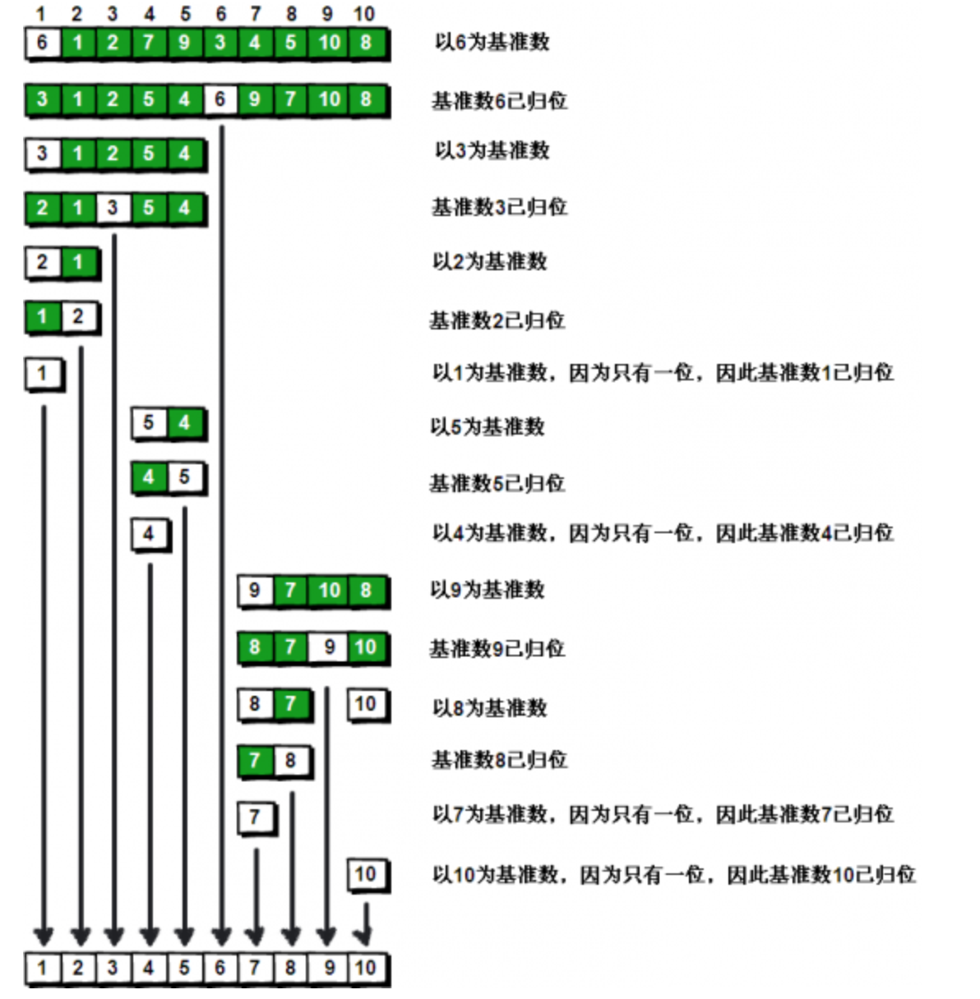

<!-- image url 
https://raw.githubusercontent.com/HealerJean/HealerJean.github.io/master/blogImages
　　首行缩进
<font color="red">  </font>
-->

## 时间复杂度求法

[https://www.cnblogs.com/dragondove/p/6389177.html](https://www.cnblogs.com/dragondove/p/6389177.html)

<table>
<thead>
<tr><th align="center">排序方法</th><th align="center">时间复杂度（平均）</th><th align="center">时间复杂度（最坏)</th><th align="center">时间复杂度（最好)</th><th align="center">空间复杂度</th><th align="center">稳定性</th><th align="center">复杂性</th></tr>
</thead>
<tbody>
<tr>
<td align="center">直接插入排序</td>
<td align="center"><span id="MathJax-Element-97-Frame" class="MathJax" data-mathml="<math xmlns=&quot;http://www.w3.org/1998/Math/MathML&quot;><mi>O</mi><mo stretchy=&quot;false&quot;>(</mo><msup><mi>n</mi><mn>2</mn></msup><mo stretchy=&quot;false&quot;>)</mo></math>"><span id="MathJax-Span-1" class="math"><span id="MathJax-Span-2" class="mrow"><span id="MathJax-Span-3" class="mi">O<span id="MathJax-Span-4" class="mo">(<span id="MathJax-Span-5" class="msubsup"><span id="MathJax-Span-6" class="mi">n<span id="MathJax-Span-7" class="mn">2<span id="MathJax-Span-8" class="mo">)</span></span></span></span></span></span></span></span><span class="MJX_Assistive_MathML">O(n2)</span></span></td>
<td align="center"><span id="MathJax-Element-98-Frame" class="MathJax" data-mathml="<math xmlns=&quot;http://www.w3.org/1998/Math/MathML&quot;><mi>O</mi><mo stretchy=&quot;false&quot;>(</mo><msup><mi>n</mi><mn>2</mn></msup><mo stretchy=&quot;false&quot;>)</mo></math>"><span id="MathJax-Span-9" class="math"><span id="MathJax-Span-10" class="mrow"><span id="MathJax-Span-11" class="mi">O<span id="MathJax-Span-12" class="mo">(<span id="MathJax-Span-13" class="msubsup"><span id="MathJax-Span-14" class="mi">n<span id="MathJax-Span-15" class="mn">2<span id="MathJax-Span-16" class="mo">)</span></span></span></span></span></span></span></span><span class="MJX_Assistive_MathML">O(n2)</span></span></td>
<td align="center"><span id="MathJax-Element-99-Frame" class="MathJax" data-mathml="<math xmlns=&quot;http://www.w3.org/1998/Math/MathML&quot;><mi>O</mi><mo stretchy=&quot;false&quot;>(</mo><mi>n</mi><mo stretchy=&quot;false&quot;>)</mo></math>"><span id="MathJax-Span-17" class="math"><span id="MathJax-Span-18" class="mrow"><span id="MathJax-Span-19" class="mi">O<span id="MathJax-Span-20" class="mo">(<span id="MathJax-Span-21" class="mi">n<span id="MathJax-Span-22" class="mo">)</span></span></span></span></span></span><span class="MJX_Assistive_MathML">O(n)</span></span></td>
<td align="center"><span id="MathJax-Element-100-Frame" class="MathJax" data-mathml="<math xmlns=&quot;http://www.w3.org/1998/Math/MathML&quot;><mi>O</mi><mo stretchy=&quot;false&quot;>(</mo><mn>1</mn><mo stretchy=&quot;false&quot;>)</mo></math>"><span id="MathJax-Span-23" class="math"><span id="MathJax-Span-24" class="mrow"><span id="MathJax-Span-25" class="mi">O<span id="MathJax-Span-26" class="mo">(<span id="MathJax-Span-27" class="mn">1<span id="MathJax-Span-28" class="mo">)</span></span></span></span></span></span><span class="MJX_Assistive_MathML">O(1)</span></span></td>
<td align="center">稳定</td>
<td align="center">简单</td>
</tr>
<tr>
<td align="center">希尔排序</td>
<td align="center"><span id="MathJax-Element-101-Frame" class="MathJax" data-mathml="<math xmlns=&quot;http://www.w3.org/1998/Math/MathML&quot;><mi>O</mi><mo stretchy=&quot;false&quot;>(</mo><mi>n</mi><mi>l</mi><mi>o</mi><msub><mi>g</mi><mrow class=&quot;MJX-TeXAtom-ORD&quot;><mn>2</mn></mrow></msub><mi>n</mi><mo stretchy=&quot;false&quot;>)</mo></math>"><span id="MathJax-Span-29" class="math"><span id="MathJax-Span-30" class="mrow"><span id="MathJax-Span-31" class="mi">O<span id="MathJax-Span-32" class="mo">(<span id="MathJax-Span-33" class="mi">n<span id="MathJax-Span-34" class="mi">l<span id="MathJax-Span-35" class="mi">o<span id="MathJax-Span-36" class="msubsup"><span id="MathJax-Span-37" class="mi">g<span id="MathJax-Span-38" class="texatom"><span id="MathJax-Span-39" class="mrow"><span id="MathJax-Span-40" class="mn">2<span id="MathJax-Span-41" class="mi">n<span id="MathJax-Span-42" class="mo">)</span></span></span></span></span></span></span></span></span></span></span></span></span></span><span class="MJX_Assistive_MathML">O(nlog2n)</span></span></td>
<td align="center"><span id="MathJax-Element-102-Frame" class="MathJax" data-mathml="<math xmlns=&quot;http://www.w3.org/1998/Math/MathML&quot;><mi>O</mi><mo stretchy=&quot;false&quot;>(</mo><msup><mi>n</mi><mn>2</mn></msup><mo stretchy=&quot;false&quot;>)</mo></math>"><span id="MathJax-Span-43" class="math"><span id="MathJax-Span-44" class="mrow"><span id="MathJax-Span-45" class="mi">O<span id="MathJax-Span-46" class="mo">(<span id="MathJax-Span-47" class="msubsup"><span id="MathJax-Span-48" class="mi">n<span id="MathJax-Span-49" class="mn">2<span id="MathJax-Span-50" class="mo">)</span></span></span></span></span></span></span></span><span class="MJX_Assistive_MathML">O(n2)</span></span></td>
<td align="center"><span id="MathJax-Element-103-Frame" class="MathJax" data-mathml="<math xmlns=&quot;http://www.w3.org/1998/Math/MathML&quot;><mi>O</mi><mo stretchy=&quot;false&quot;>(</mo><mi>n</mi><mo stretchy=&quot;false&quot;>)</mo></math>"><span id="MathJax-Span-51" class="math"><span id="MathJax-Span-52" class="mrow"><span id="MathJax-Span-53" class="mi">O<span id="MathJax-Span-54" class="mo">(<span id="MathJax-Span-55" class="mi">n<span id="MathJax-Span-56" class="mo">)</span></span></span></span></span></span><span class="MJX_Assistive_MathML">O(n)</span></span></td>
<td align="center"><span id="MathJax-Element-104-Frame" class="MathJax" data-mathml="<math xmlns=&quot;http://www.w3.org/1998/Math/MathML&quot;><mi>O</mi><mo stretchy=&quot;false&quot;>(</mo><mn>1</mn><mo stretchy=&quot;false&quot;>)</mo></math>"><span id="MathJax-Span-57" class="math"><span id="MathJax-Span-58" class="mrow"><span id="MathJax-Span-59" class="mi">O<span id="MathJax-Span-60" class="mo">(<span id="MathJax-Span-61" class="mn">1<span id="MathJax-Span-62" class="mo">)</span></span></span></span></span></span><span class="MJX_Assistive_MathML">O(1)</span></span></td>
<td align="center">不稳定</td>
<td align="center">较复杂</td>
</tr>
<tr>
<td align="center">直接选择排序</td>
<td align="center"><span id="MathJax-Element-105-Frame" class="MathJax" data-mathml="<math xmlns=&quot;http://www.w3.org/1998/Math/MathML&quot;><mi>O</mi><mo stretchy=&quot;false&quot;>(</mo><msup><mi>n</mi><mn>2</mn></msup><mo stretchy=&quot;false&quot;>)</mo></math>"><span id="MathJax-Span-63" class="math"><span id="MathJax-Span-64" class="mrow"><span id="MathJax-Span-65" class="mi">O<span id="MathJax-Span-66" class="mo">(<span id="MathJax-Span-67" class="msubsup"><span id="MathJax-Span-68" class="mi">n<span id="MathJax-Span-69" class="mn">2<span id="MathJax-Span-70" class="mo">)</span></span></span></span></span></span></span></span><span class="MJX_Assistive_MathML">O(n2)</span></span></td>
<td align="center"><span id="MathJax-Element-106-Frame" class="MathJax" data-mathml="<math xmlns=&quot;http://www.w3.org/1998/Math/MathML&quot;><mi>O</mi><mo stretchy=&quot;false&quot;>(</mo><msup><mi>n</mi><mn>2</mn></msup><mo stretchy=&quot;false&quot;>)</mo></math>"><span id="MathJax-Span-71" class="math"><span id="MathJax-Span-72" class="mrow"><span id="MathJax-Span-73" class="mi">O<span id="MathJax-Span-74" class="mo">(<span id="MathJax-Span-75" class="msubsup"><span id="MathJax-Span-76" class="mi">n<span id="MathJax-Span-77" class="mn">2<span id="MathJax-Span-78" class="mo">)</span></span></span></span></span></span></span></span><span class="MJX_Assistive_MathML">O(n2)</span></span></td>
<td align="center"><span id="MathJax-Element-107-Frame" class="MathJax" data-mathml="<math xmlns=&quot;http://www.w3.org/1998/Math/MathML&quot;><mi>O</mi><mo stretchy=&quot;false&quot;>(</mo><msup><mi>n</mi><mn>2</mn></msup><mo stretchy=&quot;false&quot;>)</mo></math>"><span id="MathJax-Span-79" class="math"><span id="MathJax-Span-80" class="mrow"><span id="MathJax-Span-81" class="mi">O<span id="MathJax-Span-82" class="mo">(<span id="MathJax-Span-83" class="msubsup"><span id="MathJax-Span-84" class="mi">n<span id="MathJax-Span-85" class="mn">2<span id="MathJax-Span-86" class="mo">)</span></span></span></span></span></span></span></span><span class="MJX_Assistive_MathML">O(n2)</span></span></td>
<td align="center"><span id="MathJax-Element-108-Frame" class="MathJax" data-mathml="<math xmlns=&quot;http://www.w3.org/1998/Math/MathML&quot;><mi>O</mi><mo stretchy=&quot;false&quot;>(</mo><mn>1</mn><mo stretchy=&quot;false&quot;>)</mo></math>"><span id="MathJax-Span-87" class="math"><span id="MathJax-Span-88" class="mrow"><span id="MathJax-Span-89" class="mi">O<span id="MathJax-Span-90" class="mo">(<span id="MathJax-Span-91" class="mn">1<span id="MathJax-Span-92" class="mo">)</span></span></span></span></span></span><span class="MJX_Assistive_MathML">O(1)</span></span></td>
<td align="center">不稳定</td>
<td align="center">简单</td>
</tr>
<tr>
<td align="center">堆排序</td>
<td align="center"><span id="MathJax-Element-109-Frame" class="MathJax" data-mathml="<math xmlns=&quot;http://www.w3.org/1998/Math/MathML&quot;><mi>O</mi><mo stretchy=&quot;false&quot;>(</mo><mi>n</mi><mi>l</mi><mi>o</mi><msub><mi>g</mi><mrow class=&quot;MJX-TeXAtom-ORD&quot;><mn>2</mn></mrow></msub><mi>n</mi><mo stretchy=&quot;false&quot;>)</mo></math>"><span id="MathJax-Span-93" class="math"><span id="MathJax-Span-94" class="mrow"><span id="MathJax-Span-95" class="mi">O<span id="MathJax-Span-96" class="mo">(<span id="MathJax-Span-97" class="mi">n<span id="MathJax-Span-98" class="mi">l<span id="MathJax-Span-99" class="mi">o<span id="MathJax-Span-100" class="msubsup"><span id="MathJax-Span-101" class="mi">g<span id="MathJax-Span-102" class="texatom"><span id="MathJax-Span-103" class="mrow"><span id="MathJax-Span-104" class="mn">2<span id="MathJax-Span-105" class="mi">n<span id="MathJax-Span-106" class="mo">)</span></span></span></span></span></span></span></span></span></span></span></span></span></span><span class="MJX_Assistive_MathML">O(nlog2n)</span></span></td>
<td align="center"><span id="MathJax-Element-110-Frame" class="MathJax" data-mathml="<math xmlns=&quot;http://www.w3.org/1998/Math/MathML&quot;><mi>O</mi><mo stretchy=&quot;false&quot;>(</mo><mi>n</mi><mi>l</mi><mi>o</mi><msub><mi>g</mi><mrow class=&quot;MJX-TeXAtom-ORD&quot;><mn>2</mn></mrow></msub><mi>n</mi><mo stretchy=&quot;false&quot;>)</mo></math>"><span id="MathJax-Span-107" class="math"><span id="MathJax-Span-108" class="mrow"><span id="MathJax-Span-109" class="mi">O<span id="MathJax-Span-110" class="mo">(<span id="MathJax-Span-111" class="mi">n<span id="MathJax-Span-112" class="mi">l<span id="MathJax-Span-113" class="mi">o<span id="MathJax-Span-114" class="msubsup"><span id="MathJax-Span-115" class="mi">g<span id="MathJax-Span-116" class="texatom"><span id="MathJax-Span-117" class="mrow"><span id="MathJax-Span-118" class="mn">2<span id="MathJax-Span-119" class="mi">n<span id="MathJax-Span-120" class="mo">)</span></span></span></span></span></span></span></span></span></span></span></span></span></span><span class="MJX_Assistive_MathML">O(nlog2n)</span></span></td>
<td align="center"><span id="MathJax-Element-111-Frame" class="MathJax" data-mathml="<math xmlns=&quot;http://www.w3.org/1998/Math/MathML&quot;><mi>O</mi><mo stretchy=&quot;false&quot;>(</mo><mi>n</mi><mi>l</mi><mi>o</mi><msub><mi>g</mi><mrow class=&quot;MJX-TeXAtom-ORD&quot;><mn>2</mn></mrow></msub><mi>n</mi><mo stretchy=&quot;false&quot;>)</mo></math>"><span id="MathJax-Span-121" class="math"><span id="MathJax-Span-122" class="mrow"><span id="MathJax-Span-123" class="mi">O<span id="MathJax-Span-124" class="mo">(<span id="MathJax-Span-125" class="mi">n<span id="MathJax-Span-126" class="mi">l<span id="MathJax-Span-127" class="mi">o<span id="MathJax-Span-128" class="msubsup"><span id="MathJax-Span-129" class="mi">g<span id="MathJax-Span-130" class="texatom"><span id="MathJax-Span-131" class="mrow"><span id="MathJax-Span-132" class="mn">2<span id="MathJax-Span-133" class="mi">n<span id="MathJax-Span-134" class="mo">)</span></span></span></span></span></span></span></span></span></span></span></span></span></span><span class="MJX_Assistive_MathML">O(nlog2n)</span></span></td>
<td align="center"><span id="MathJax-Element-112-Frame" class="MathJax" data-mathml="<math xmlns=&quot;http://www.w3.org/1998/Math/MathML&quot;><mi>O</mi><mo stretchy=&quot;false&quot;>(</mo><mn>1</mn><mo stretchy=&quot;false&quot;>)</mo></math>"><span id="MathJax-Span-135" class="math"><span id="MathJax-Span-136" class="mrow"><span id="MathJax-Span-137" class="mi">O<span id="MathJax-Span-138" class="mo">(<span id="MathJax-Span-139" class="mn">1<span id="MathJax-Span-140" class="mo">)</span></span></span></span></span></span><span class="MJX_Assistive_MathML">O(1)</span></span></td>
<td align="center">不稳定</td>
<td align="center">较复杂</td>
</tr>
<tr>
<td align="center">冒泡排序</td>
<td align="center"><span id="MathJax-Element-113-Frame" class="MathJax" data-mathml="<math xmlns=&quot;http://www.w3.org/1998/Math/MathML&quot;><mi>O</mi><mo stretchy=&quot;false&quot;>(</mo><msup><mi>n</mi><mn>2</mn></msup><mo stretchy=&quot;false&quot;>)</mo></math>"><span id="MathJax-Span-141" class="math"><span id="MathJax-Span-142" class="mrow"><span id="MathJax-Span-143" class="mi">O<span id="MathJax-Span-144" class="mo">(<span id="MathJax-Span-145" class="msubsup"><span id="MathJax-Span-146" class="mi">n<span id="MathJax-Span-147" class="mn">2<span id="MathJax-Span-148" class="mo">)</span></span></span></span></span></span></span></span><span class="MJX_Assistive_MathML">O(n2)</span></span></td>
<td align="center"><span id="MathJax-Element-114-Frame" class="MathJax" data-mathml="<math xmlns=&quot;http://www.w3.org/1998/Math/MathML&quot;><mi>O</mi><mo stretchy=&quot;false&quot;>(</mo><msup><mi>n</mi><mn>2</mn></msup><mo stretchy=&quot;false&quot;>)</mo></math>"><span id="MathJax-Span-149" class="math"><span id="MathJax-Span-150" class="mrow"><span id="MathJax-Span-151" class="mi">O<span id="MathJax-Span-152" class="mo">(<span id="MathJax-Span-153" class="msubsup"><span id="MathJax-Span-154" class="mi">n<span id="MathJax-Span-155" class="mn">2<span id="MathJax-Span-156" class="mo">)</span></span></span></span></span></span></span></span><span class="MJX_Assistive_MathML">O(n2)</span></span></td>
<td align="center"><span id="MathJax-Element-115-Frame" class="MathJax" data-mathml="<math xmlns=&quot;http://www.w3.org/1998/Math/MathML&quot;><mi>O</mi><mo stretchy=&quot;false&quot;>(</mo><mi>n</mi><mo stretchy=&quot;false&quot;>)</mo></math>"><span id="MathJax-Span-157" class="math"><span id="MathJax-Span-158" class="mrow"><span id="MathJax-Span-159" class="mi">O<span id="MathJax-Span-160" class="mo">(<span id="MathJax-Span-161" class="mi">n<span id="MathJax-Span-162" class="mo">)</span></span></span></span></span></span><span class="MJX_Assistive_MathML">O(n)</span></span></td>
<td align="center"><span id="MathJax-Element-116-Frame" class="MathJax" data-mathml="<math xmlns=&quot;http://www.w3.org/1998/Math/MathML&quot;><mi>O</mi><mo stretchy=&quot;false&quot;>(</mo><mn>1</mn><mo stretchy=&quot;false&quot;>)</mo></math>"><span id="MathJax-Span-163" class="math"><span id="MathJax-Span-164" class="mrow"><span id="MathJax-Span-165" class="mi">O<span id="MathJax-Span-166" class="mo">(<span id="MathJax-Span-167" class="mn">1<span id="MathJax-Span-168" class="mo">)</span></span></span></span></span></span><span class="MJX_Assistive_MathML">O(1)</span></span></td>
<td align="center">稳定</td>
<td align="center">简单</td>
</tr>
<tr>
<td align="center">快速排序</td>
<td align="center"><span id="MathJax-Element-117-Frame" class="MathJax" data-mathml="<math xmlns=&quot;http://www.w3.org/1998/Math/MathML&quot;><mi>O</mi><mo stretchy=&quot;false&quot;>(</mo><mi>n</mi><mi>l</mi><mi>o</mi><msub><mi>g</mi><mrow class=&quot;MJX-TeXAtom-ORD&quot;><mn>2</mn></mrow></msub><mi>n</mi><mo stretchy=&quot;false&quot;>)</mo></math>"><span id="MathJax-Span-169" class="math"><span id="MathJax-Span-170" class="mrow"><span id="MathJax-Span-171" class="mi">O<span id="MathJax-Span-172" class="mo">(<span id="MathJax-Span-173" class="mi">n<span id="MathJax-Span-174" class="mi">l<span id="MathJax-Span-175" class="mi">o<span id="MathJax-Span-176" class="msubsup"><span id="MathJax-Span-177" class="mi">g<span id="MathJax-Span-178" class="texatom"><span id="MathJax-Span-179" class="mrow"><span id="MathJax-Span-180" class="mn">2<span id="MathJax-Span-181" class="mi">n<span id="MathJax-Span-182" class="mo">)</span></span></span></span></span></span></span></span></span></span></span></span></span></span><span class="MJX_Assistive_MathML">O(nlog2n)</span></span></td>
<td align="center"><span id="MathJax-Element-118-Frame" class="MathJax" data-mathml="<math xmlns=&quot;http://www.w3.org/1998/Math/MathML&quot;><mi>O</mi><mo stretchy=&quot;false&quot;>(</mo><msup><mi>n</mi><mn>2</mn></msup><mo stretchy=&quot;false&quot;>)</mo></math>"><span id="MathJax-Span-183" class="math"><span id="MathJax-Span-184" class="mrow"><span id="MathJax-Span-185" class="mi">O<span id="MathJax-Span-186" class="mo">(<span id="MathJax-Span-187" class="msubsup"><span id="MathJax-Span-188" class="mi">n<span id="MathJax-Span-189" class="mn">2<span id="MathJax-Span-190" class="mo">)</span></span></span></span></span></span></span></span><span class="MJX_Assistive_MathML">O(n2)</span></span></td>
<td align="center"><span id="MathJax-Element-119-Frame" class="MathJax" data-mathml="<math xmlns=&quot;http://www.w3.org/1998/Math/MathML&quot;><mi>O</mi><mo stretchy=&quot;false&quot;>(</mo><mi>n</mi><mi>l</mi><mi>o</mi><msub><mi>g</mi><mrow class=&quot;MJX-TeXAtom-ORD&quot;><mn>2</mn></mrow></msub><mi>n</mi><mo stretchy=&quot;false&quot;>)</mo></math>"><span id="MathJax-Span-191" class="math"><span id="MathJax-Span-192" class="mrow"><span id="MathJax-Span-193" class="mi">O<span id="MathJax-Span-194" class="mo">(<span id="MathJax-Span-195" class="mi">n<span id="MathJax-Span-196" class="mi">l<span id="MathJax-Span-197" class="mi">o<span id="MathJax-Span-198" class="msubsup"><span id="MathJax-Span-199" class="mi">g<span id="MathJax-Span-200" class="texatom"><span id="MathJax-Span-201" class="mrow"><span id="MathJax-Span-202" class="mn">2<span id="MathJax-Span-203" class="mi">n<span id="MathJax-Span-204" class="mo">)</span></span></span></span></span></span></span></span></span></span></span></span></span></span><span class="MJX_Assistive_MathML">O(nlog2n)</span></span></td>
<td align="center"><span id="MathJax-Element-120-Frame" class="MathJax" data-mathml="<math xmlns=&quot;http://www.w3.org/1998/Math/MathML&quot;><mi>O</mi><mo stretchy=&quot;false&quot;>(</mo><mi>n</mi><mi>l</mi><mi>o</mi><msub><mi>g</mi><mrow class=&quot;MJX-TeXAtom-ORD&quot;><mn>2</mn></mrow></msub><mi>n</mi><mo stretchy=&quot;false&quot;>)</mo></math>"><span id="MathJax-Span-205" class="math"><span id="MathJax-Span-206" class="mrow"><span id="MathJax-Span-207" class="mi">O<span id="MathJax-Span-208" class="mo">(<span id="MathJax-Span-209" class="mi">n<span id="MathJax-Span-210" class="mi">l<span id="MathJax-Span-211" class="mi">o<span id="MathJax-Span-212" class="msubsup"><span id="MathJax-Span-213" class="mi">g<span id="MathJax-Span-214" class="texatom"><span id="MathJax-Span-215" class="mrow"><span id="MathJax-Span-216" class="mn">2<span id="MathJax-Span-217" class="mi">n<span id="MathJax-Span-218" class="mo">)</span></span></span></span></span></span></span></span></span></span></span></span></span></span><span class="MJX_Assistive_MathML">O(nlog2n)</span></span></td>
<td align="center">不稳定</td>
<td align="center">较复杂</td>
</tr>
<tr>
<td align="center">归并排序</td>
<td align="center"><span id="MathJax-Element-121-Frame" class="MathJax" data-mathml="<math xmlns=&quot;http://www.w3.org/1998/Math/MathML&quot;><mi>O</mi><mo stretchy=&quot;false&quot;>(</mo><mi>n</mi><mi>l</mi><mi>o</mi><msub><mi>g</mi><mrow class=&quot;MJX-TeXAtom-ORD&quot;><mn>2</mn></mrow></msub><mi>n</mi><mo stretchy=&quot;false&quot;>)</mo></math>"><span id="MathJax-Span-219" class="math"><span id="MathJax-Span-220" class="mrow"><span id="MathJax-Span-221" class="mi">O<span id="MathJax-Span-222" class="mo">(<span id="MathJax-Span-223" class="mi">n<span id="MathJax-Span-224" class="mi">l<span id="MathJax-Span-225" class="mi">o<span id="MathJax-Span-226" class="msubsup"><span id="MathJax-Span-227" class="mi">g<span id="MathJax-Span-228" class="texatom"><span id="MathJax-Span-229" class="mrow"><span id="MathJax-Span-230" class="mn">2<span id="MathJax-Span-231" class="mi">n<span id="MathJax-Span-232" class="mo">)</span></span></span></span></span></span></span></span></span></span></span></span></span></span><span class="MJX_Assistive_MathML">O(nlog2n)</span></span></td>
<td align="center"><span id="MathJax-Element-122-Frame" class="MathJax" data-mathml="<math xmlns=&quot;http://www.w3.org/1998/Math/MathML&quot;><mi>O</mi><mo stretchy=&quot;false&quot;>(</mo><mi>n</mi><mi>l</mi><mi>o</mi><msub><mi>g</mi><mrow class=&quot;MJX-TeXAtom-ORD&quot;><mn>2</mn></mrow></msub><mi>n</mi><mo stretchy=&quot;false&quot;>)</mo></math>"><span id="MathJax-Span-233" class="math"><span id="MathJax-Span-234" class="mrow"><span id="MathJax-Span-235" class="mi">O<span id="MathJax-Span-236" class="mo">(<span id="MathJax-Span-237" class="mi">n<span id="MathJax-Span-238" class="mi">l<span id="MathJax-Span-239" class="mi">o<span id="MathJax-Span-240" class="msubsup"><span id="MathJax-Span-241" class="mi">g<span id="MathJax-Span-242" class="texatom"><span id="MathJax-Span-243" class="mrow"><span id="MathJax-Span-244" class="mn">2<span id="MathJax-Span-245" class="mi">n<span id="MathJax-Span-246" class="mo">)</span></span></span></span></span></span></span></span></span></span></span></span></span></span><span class="MJX_Assistive_MathML">O(nlog2n)</span></span></td>
<td align="center"><span id="MathJax-Element-123-Frame" class="MathJax" data-mathml="<math xmlns=&quot;http://www.w3.org/1998/Math/MathML&quot;><mi>O</mi><mo stretchy=&quot;false&quot;>(</mo><mi>n</mi><mi>l</mi><mi>o</mi><msub><mi>g</mi><mrow class=&quot;MJX-TeXAtom-ORD&quot;><mn>2</mn></mrow></msub><mi>n</mi><mo stretchy=&quot;false&quot;>)</mo></math>"><span id="MathJax-Span-247" class="math"><span id="MathJax-Span-248" class="mrow"><span id="MathJax-Span-249" class="mi">O<span id="MathJax-Span-250" class="mo">(<span id="MathJax-Span-251" class="mi">n<span id="MathJax-Span-252" class="mi">l<span id="MathJax-Span-253" class="mi">o<span id="MathJax-Span-254" class="msubsup"><span id="MathJax-Span-255" class="mi">g<span id="MathJax-Span-256" class="texatom"><span id="MathJax-Span-257" class="mrow"><span id="MathJax-Span-258" class="mn">2<span id="MathJax-Span-259" class="mi">n<span id="MathJax-Span-260" class="mo">)</span></span></span></span></span></span></span></span></span></span></span></span></span></span><span class="MJX_Assistive_MathML">O(nlog2n)</span></span></td>
<td align="center"><span id="MathJax-Element-124-Frame" class="MathJax" data-mathml="<math xmlns=&quot;http://www.w3.org/1998/Math/MathML&quot;><mi>O</mi><mo stretchy=&quot;false&quot;>(</mo><mi>n</mi><mo stretchy=&quot;false&quot;>)</mo></math>"><span id="MathJax-Span-261" class="math"><span id="MathJax-Span-262" class="mrow"><span id="MathJax-Span-263" class="mi">O<span id="MathJax-Span-264" class="mo">(<span id="MathJax-Span-265" class="mi">n<span id="MathJax-Span-266" class="mo">)</span></span></span></span></span></span><span class="MJX_Assistive_MathML">O(n)</span></span></td>
<td align="center">稳定</td>
<td align="center">较复杂</td>
</tr>
<tr>
<td align="center">基数排序</td>
<td align="center"><span id="MathJax-Element-125-Frame" class="MathJax" data-mathml="<math xmlns=&quot;http://www.w3.org/1998/Math/MathML&quot;><mi>O</mi><mo stretchy=&quot;false&quot;>(</mo><mi>d</mi><mo stretchy=&quot;false&quot;>(</mo><mi>n</mi><mo>+</mo><mi>r</mi><mo stretchy=&quot;false&quot;>)</mo><mo stretchy=&quot;false&quot;>)</mo></math>"><span id="MathJax-Span-267" class="math"><span id="MathJax-Span-268" class="mrow"><span id="MathJax-Span-269" class="mi">O<span id="MathJax-Span-270" class="mo">(<span id="MathJax-Span-271" class="mi">d<span id="MathJax-Span-272" class="mo">(<span id="MathJax-Span-273" class="mi">n<span id="MathJax-Span-274" class="mo">+<span id="MathJax-Span-275" class="mi">r<span id="MathJax-Span-276" class="mo">)<span id="MathJax-Span-277" class="mo">)</span></span></span></span></span></span></span></span></span></span></span><span class="MJX_Assistive_MathML">O(d(n+r))</span></span></td>
<td align="center"><span id="MathJax-Element-126-Frame" class="MathJax" data-mathml="<math xmlns=&quot;http://www.w3.org/1998/Math/MathML&quot;><mi>O</mi><mo stretchy=&quot;false&quot;>(</mo><mi>d</mi><mo stretchy=&quot;false&quot;>(</mo><mi>n</mi><mo>+</mo><mi>r</mi><mo stretchy=&quot;false&quot;>)</mo><mo stretchy=&quot;false&quot;>)</mo></math>"><span id="MathJax-Span-278" class="math"><span id="MathJax-Span-279" class="mrow"><span id="MathJax-Span-280" class="mi">O<span id="MathJax-Span-281" class="mo">(<span id="MathJax-Span-282" class="mi">d<span id="MathJax-Span-283" class="mo">(<span id="MathJax-Span-284" class="mi">n<span id="MathJax-Span-285" class="mo">+<span id="MathJax-Span-286" class="mi">r<span id="MathJax-Span-287" class="mo">)<span id="MathJax-Span-288" class="mo">)</span></span></span></span></span></span></span></span></span></span></span><span class="MJX_Assistive_MathML">O(d(n+r))</span></span></td>
<td align="center"><span id="MathJax-Element-127-Frame" class="MathJax" data-mathml="<math xmlns=&quot;http://www.w3.org/1998/Math/MathML&quot;><mi>O</mi><mo stretchy=&quot;false&quot;>(</mo><mi>d</mi><mo stretchy=&quot;false&quot;>(</mo><mi>n</mi><mo>+</mo><mi>r</mi><mo stretchy=&quot;false&quot;>)</mo><mo stretchy=&quot;false&quot;>)</mo></math>"><span id="MathJax-Span-289" class="math"><span id="MathJax-Span-290" class="mrow"><span id="MathJax-Span-291" class="mi">O<span id="MathJax-Span-292" class="mo">(<span id="MathJax-Span-293" class="mi">d<span id="MathJax-Span-294" class="mo">(<span id="MathJax-Span-295" class="mi">n<span id="MathJax-Span-296" class="mo">+<span id="MathJax-Span-297" class="mi">r<span id="MathJax-Span-298" class="mo">)<span id="MathJax-Span-299" class="mo">)</span></span></span></span></span></span></span></span></span></span></span><span class="MJX_Assistive_MathML">O(d(n+r))</span></span></td>
<td align="center"><span id="MathJax-Element-128-Frame" class="MathJax" data-mathml="<math xmlns=&quot;http://www.w3.org/1998/Math/MathML&quot;><mi>O</mi><mo stretchy=&quot;false&quot;>(</mo><mi>n</mi><mo>+</mo><mi>r</mi><mo stretchy=&quot;false&quot;>)</mo></math>"><span id="MathJax-Span-300" class="math"><span id="MathJax-Span-301" class="mrow"><span id="MathJax-Span-302" class="mi">O<span id="MathJax-Span-303" class="mo">(<span id="MathJax-Span-304" class="mi">n<span id="MathJax-Span-305" class="mo">+<span id="MathJax-Span-306" class="mi">r<span id="MathJax-Span-307" class="mo">)</span></span></span></span></span></span></span></span><span class="MJX_Assistive_MathML">O(n+r)</span></span></td>
<td align="center">稳定</td>
<td align="center">较复杂</td>
</tr>
</tbody>
</table>


## 1、直接插入排序


1、直接插入排序 ：从第二个开始，依次和前一个进行比较，插入一个有序序列（注意和选择排序的区别）

```java


 /**
     * 1、直接插入排序 ：个人理解，就是往后移动，依次把小的放到前面来
     */
    @Test
    public  void insertionSort() {
        int[] a = { 49, 38, 65, 97, 76, 13, 27, 50 };
        System.out.println("----------插入排序开始：---------");
        print(a);
        for (int i = 1; i < a.length; i++) {//从i等于1开始表示a[1] 也即是从第二个数字开始进行比较，进行n-1趟排序
            // 待插入元素
            int temp = a[i];
            int j ;
            for (j = i; j >  0; j--)
            {
                // 将大于temp的往后移动一位,其实就是和temp进行比较移动，已经排序的二舅不会移动了
                if (a[j-1] > temp)
                {
                    a[j] = a[j-1]; //执行完这个 j之后还要 继续执行下一个  j 最后代表的就是 实际 带待插入元素的位置
                }
                else
                {
                    break;
                }
            }

            a[j] = temp; //，如果不变则原封不动给它(主要原因)，如果变了则将它赋值给j  进行归为，此时的j就是我们上面排序之后找到的j的位置

            System.out.printf("第"+i+"趟排序结果,");
            print(a);
        }

        System.out.print("最终插入排序结果： ");
        print(a);
        System.out.println("--------------------");
    }
    

/**
 *
 打印的结果
 */
private static void print(int []a) {
    for (int i : a){
        System.out.print(i + " ");
    }
    System.out.println();
}


```

### 1、时间复杂度O(n^2)： 

```
当问题规模为n时

最好情况（原本就是有序的）
比较次数：Cmin=n-1
移动次数：Mmin=0


最差情况（逆序）

比较次数：Cmax=1+2+3+4+……+n-1=(n-1)n/2
移动次数：Mmax=1+2+3+……+n-1=(n-1)n/2

若待排序对象序列中出现各种可能排列的概率相同，则可取上述最好情况和最坏情况的平均情况。在平均情况下的关键字比较次数和对象移动次数约为 n^2/4。（大O推导 1/4 可以去掉）因此，直接插入排序的时间复杂度为 o(n^2)。


```

### 2、空间复杂度： 

插入排序过程中，需要一个临时变量temp存储待排序元素，因此空间复杂度为O(1)。

### 3、算法稳定性： 

插入排序是一种稳定的排序算法。

## 2、希尔排序


```java
import org.junit.Test;

/**
 * @Description
 * @Author HealerJean
 * @Date 2018/4/23  下午3:15.
 */
public class 希尔排序 {

    /**
     2、希尔排序.最小缩量排序  比如 8/8 个数字 4 2 1
     希尔排序是基于插入排序提出改进方法的：

     1、插入排序在对几乎已经排好序的数据操作时， 效率高， 即可以达到线性排序的效率，但插入排序一般来说是低效的， 因为插入排序每次只能将数据移动一位

     希尔排序的基本思想是：
        先将整个待排序的记录序列分割成为若干子序列分别进行直接插入排序，
       待整个序列中的记录“基本有序”时，再对全体记录进行依次直接插入排序。
     */


    @Test
    public void 希尔排序算法(){

        int[] a = { 49, 38, 65, 97, 76, 13, 27, 50 };
        System.out.println("----------希尔排序开始：---------");

        int incr = a.length/2; //希尔排序增量，//被分成4组 ，也即是第1个和第5个进行比较 ，低2个和低6个比较
        int temp ;
        while (incr>=1){ //当增量为0的时候排序完成
            for(int i = 0 ;i< a.length;i++){ //这里的每一趟相当于是一次插入排序的排序算法，不同的是，这里是从前往后
            					   	//以为是从前往后第一个数字开始比较，所以初始化i=0 ，插入排序是从后往前比较
                for(int j = i; j < a.length-incr;j=j+incr){ //J的大小不会超过增量，而且因为每次都是j 和 j+incr
                                                            // 所以每趟都要J = j+incr,
                                                           // 当这个数字加起来超过 length-incr的时候，就完成一次比较
                    if(a[j]>a[j+incr]){
                        temp = a[j];
                        a[j] = a[j+incr];
                        a[j+incr]=temp;
                    }


                }
            }
            print(a);
            incr = incr/2;
        }
        print(a);


    }

    


    /**
     *
     打印的结果
     */
    private static void print(int []a) {
        for (int i : a){
            System.out.print(i + " ");
        }
        System.out.println();
    }


}


```


## 3、选择排序 （每次选择最小的放到最前面）

```java
import org.junit.Test;

/**
 * @Description
 * @Author HealerJean
 * @Date 2018/4/23  下午4:04.
 */
public class 选择排序 {


    @Test
    public  void 选择排序算法(){
        int []a = { 49, 38, 65, 97, 76, 13, 27, 50 };

        int min;
        for(int i = 0; i<a.length-1;i++){ //从前往后比较，i一直到a.length 也就是最后一个还需要往前移动
            min = i; //首先默认第一个为min最小值
            for(int j = i+1 ; j<a.length;j++) { //以为是和min比较 ，不需要自己跟自己比较，min初始给的i，所以j=i+1;
                if(a[min]  > a[j]){
                    min = j; //每次都把最小的给min
                }
            }
            if(min!=i){//每趟排序之后，min的值都会不一样 ,而每次的min都是开始的i，所以当下的i和min进行替换
                int temp = a[min];
                a[min] = a[i];
                a[i] =temp;
            }
            print(a);
        }
        print(a);
    }


    /**
     *
     打印的结果
     */
    private static void print(int []a) {
        for (int i : a){
            System.out.print(i + " ");
        }
        System.out.println();
    }

}


```


## 4、快速排序

1．先从数列中取出一个数作为基准数。下面

2．分区过程，将比这个数大的数全放到它的右边，小于或等于它的数全放到它的左边。

3．再对左右区间重复第二步，直到各区间只有一个数。




```java
import org.junit.Test;

/**
 * @Description
 * @Author HealerJean
 * @Date 2018/4/23  下午5:47.
 */
public class 快速排序 {


    /*
     * 4.快速排序 从两端向中间靠拢
     1．先从数列中取出一个数作为基准数。

     2．分区过程，将比这个数大的数全放到它的右边，小于或等于它的数全放到它的左边。

     3．再对左右区间重复第二步，直到各区间只有一个数。
     */
    public void QuickSort(int []a, int low, int high){

        int i=low,j=high;
        if(i<j){ //当i小于J的时候执行，也就是说low必须小于hign
            int po = a[low]; //po为基数
            while(i<j){
                while(i<j && po<a[j]){   //肯定是i<j的 ，一旦po小于后面的，那么j就减1， 从后往前推 j--
                                             //这里是while循环 ，一定到最后是po>a[j] 所以一定到了最后是i<j基本上毫无疑问的
                    j--;
                }
                if(i<j){ //通过上面的while，肯定需要交换了。
                    int temp = a[i];
                    a[i] = a[j];
                    a[j] = temp;
                    i++; //i往前推进，交换完成i++
                }


                while(i<j && po>a[i]){   // 如果前面的大于后面的，肯定要推进的  从前往后推 i++
                    i++;
                }

                if(i<j){
                    int temp = a[i];
                    a[i] = a[j];
                    a[j] = temp;
                    j--;
                }
            }
            QuickSort(a,low,j-1);   //从小到J 分成两组
            QuickSort(a,j+1,high);  //从J到到 分成两组
        }
    }

    /*
     * 4.快速排序  测试方法
     */
    @Test
    public void 快速排序算法(){
        int []a = { 49, 38, 65, 97, 76, 13, 27, 50 };
        int low = 0; //第一位
        int high = a.length-1; //最后一位
        QuickSort(a, low, high);
        print(a);
    }


    /**
     *
     打印的结果
     */
    private static void print(int []a) {
        for (int i : a){
            System.out.print(i + " ");
        }
        System.out.println();
    }


}


```

## 5、冒泡排序


```java
import org.junit.Test;

/**
 * @Description
 * @Author HealerJean
 * @Date 2018/4/23  下午6:39.
 */
public class 冒泡排序 {

    /**
     3、冒泡排序，其实就是将大的向后移动
     */
    @Test
    public  void maopao(){
        int str[] = { 49, 38, 65, 97, 76, 13, 27, 50 };
        System.out.println("----------冒泡排序 开始：---------");

        for (int i = 0; i <str.length-1; i++){    //最多做n-1趟排序
            for(int j = 0 ;j <str.length - i - 1; j++){    //对当前无序区间str[0......length-i-1]进行排序(j的范围很关键，这个范围是在逐步缩小的)
                if(str[j] > str[j + 1]){    //把小的值放到前面
                    int temp = str[j];
                    str[j] = str[j + 1];
                    str[j + 1] = temp;
                }
            }
            int n = i+1;
            System.out.printf("第"+n+"趟排序结果,");
            print(str);
        }
        System.out.print("最终排序结果：");
        print(str);


    }


    /*
     * 冒泡排序优化一
     * 设置一个标记来标志一趟比较是否发生交换
     * 如果没有发生交换，则数组已经有序
     * */
    @Test
    public void bubbleSort1() {
        int a[] = { 49, 38, 65,  76, 13, 27, 50 ,97};

        for (int i = 0; i <  a.length-1; ++i) {
            int  flag = 0;
            for ( int j = 0; j <  a.length - 1 - i; ++j) {
                if (a[j] > a[j + 1]) {
                    flag = 1;
                    int tmp = a[j];
                    a[j] = a[j + 1];
                    a[j + 1] = tmp;
                }
            }
            if (flag == 0) { //当一趟比较没有发送交换的时间表示一件有序
                break;
            }
        }

        print(a);

    }

    /**
     *
     打印的结果
     */
    private static void print(int []a) {
        for (int i : a){
            System.out.print(i + " ");
        }
        System.out.println();
    }
}


 
```
 
 
## 6、折半查找，二分查找

在已经有序的基础上进行查找


```java
/**
 * @Description
 * @Author HealerJean
 * @Date 2018/4/24  下午12:09.
 */
public class 折半查找 { //先有序，再折半查找
    public static void main(String[] args) {

        int array[]=new int[]{1,2,3,4,5,6,7,8,9,10,11,12,13,14,15,16,16,17,18,19,20};
        int low=0;
        int high=array.length-1;
        int mid;
        int x=20;
        while(low<=high){ //最后的情况一定是相等
            mid=(low+high)/2;
            if(array[mid]==x){
                System.out.println(x+"在数组中出现的位置"+mid);
                break;
            }
            if(array[mid]<x){
                low=mid+1;
            }
            if(array[mid]>x){
                high=mid-1;
            }
            if(low>high){
                System.out.println("查找失败");
                break;
            }
        }

    }

}


``` 
 

<br/><br/><br/>
如果满意，请打赏博主任意金额，感兴趣的请下方留言吧。可与博主自由讨论哦

|支付包 | 微信|微信公众号|
|:-------:|:-------:|:------:|
| | ||


<!-- Gitalk 评论 start  -->

<link rel="stylesheet" href="https://unpkg.com/gitalk/dist/gitalk.css">
<script src="https://unpkg.com/gitalk@latest/dist/gitalk.min.js"></script> 
<div id="gitalk-container"></div>    
 <script type="text/javascript">
    var gitalk = new Gitalk({
		clientID: `1d164cd85549874d0e3a`,
		clientSecret: `527c3d223d1e6608953e835b547061037d140355`,
		repo: `HealerJean.github.io`,
		owner: 'HealerJean',
		admin: ['HealerJean'],
		id: '1hfwb9vqc6B68Hrw',
    });
    gitalk.render('gitalk-container');
</script> 

<!-- Gitalk end -->

