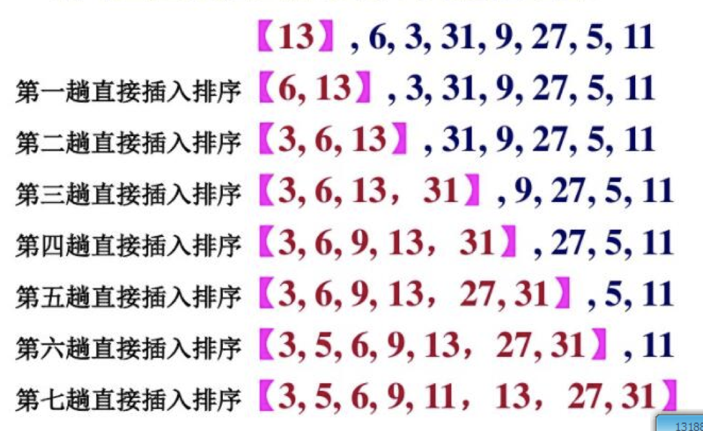

<!-- image url 
https://raw.githubusercontent.com/HealerJean123/HealerJean123.github.io/master/blogImages
　　首行缩进
  
-->

## 前言

博主其实一直对于排序算法不关注，即使在大学也是，因为我觉得排序算法根本用不到，即使用到了，上网一查不就好了。但是，但是，面试的时候总是问，我当时就想知道问这有啥意思。但是后来面试失败了，小姐姐告诉我说，其实我们更加看重的不是你的经验有多少，而是你真正的基础怎么样。 好了，如果想去好公司，算法基本上是必考的

## 1、插入排序

插入排序是一种最简单直观的排序算法，它的工作原理是通过构建有序序列，对于未排序数据，在已排序序列中从后向前扫描，找到相应位置并插入。
算法步骤：
1）将第一待排序序列第一个元素看做一个有序序列，把第二个元素到最后一个元素当成是未排序序列。
2）从头到尾依次扫描未排序序列，将扫描到的每个元素插入有序序列的适当位置。（如果待插入的元素与有序序列中的某个元素相等，则将待插入元素插入到相等元素的后面。）

   
如果满意，请打赏博主任意金额，感兴趣的请下方留言吧。可与博主自由讨论哦

|支付包 | 微信|微信公众号|
|:-------:|:-------:|:------:|
| | ||

<!-- Gitalk 评论 start  -->

<link rel="stylesheet" href="https://unpkg.com/gitalk/dist/gitalk.css">
 

    
  

<!-- Gitalk end -->

