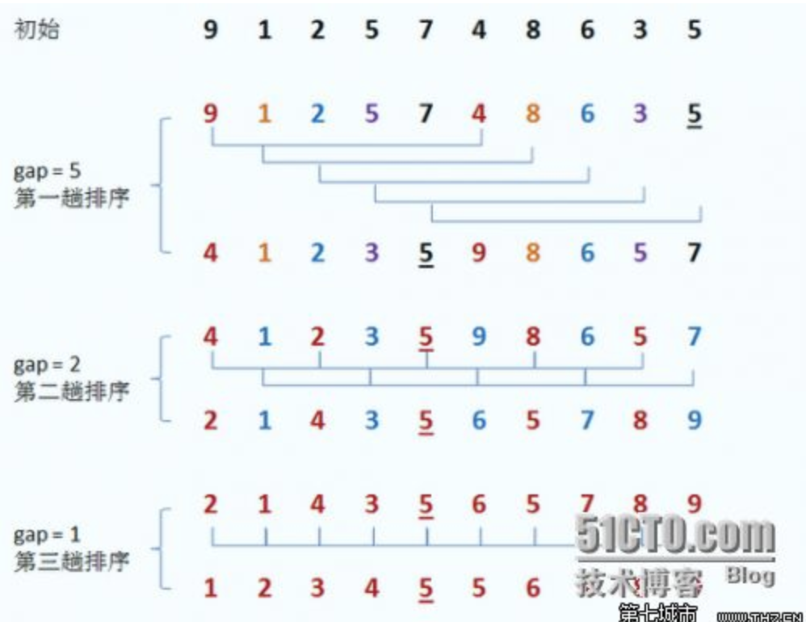
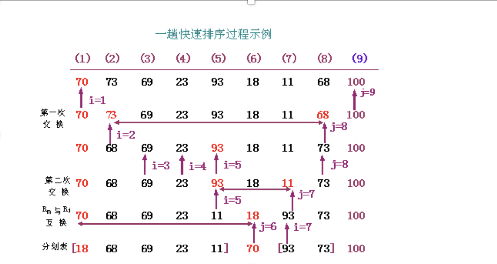

<!-- image url 
https://raw.githubusercontent.com/HealerJean123/HealerJean123.github.io/master/blogImages
　　首行缩进
<font color="red">  </font>
-->

## 前言

博主其实一直对于排序算法不关注，即使在大学也是，因为我觉得排序算法根本用不到，即使用到了，上网一查不就好了。但是，但是，面试的时候总是问，我当时就想知道问这有啥意思。但是后来面试失败了，小姐姐告诉我说，其实我们更加看重的不是你的经验有多少，而是你真正的基础怎么样。 好了，如果想去好公司，算法基本上是必考的

## 1、插入排序


```
  
/**
 * 1、直接插入排序 ：个人理解，就是往后移动，依次把小的放到前面来
 */
@Test
public  void insertionSort() {
 int[] a = { 49, 38, 65, 97, 76, 13, 27, 50 };
 System.out.println("----------插入排序开始：---------");
 print(a);
    int tmp; 
    for (int i = 1; i < a.length; i++) {//从i等于1开始表示a[1] 也即是从第二个数字开始进行比较，进行n-1趟排序
        for (int j = i; j > 0; j--) { //将i赋值给i，也就是将当前未排序数据的位置赋值给j，进行已经有序队列中，的插入
            if (a[j] < a[j - 1]) { //进行从小到大的排序，然后进行赋值 职业的话，就能够得到有序数组a 和未排序的数组
                tmp = a[j - 1];
                a[j - 1] = a[j];
                a[j] = tmp;
            }
        }
        System.out.printf("第"+i+"趟排序结果,");
        print(a);
    }
    
    System.out.print("最终插入排序结果： ");
    print(a);
    System.out.println("--------------------");
}

/**
 *
 打印的结果
 */
private static void print(int []a) {
    for (int i : a){
        System.out.print(i + " ");
    }
    System.out.println();
}


```


## 2、希尔排序




```
import org.junit.Test;

/**
 * @Description
 * @Author HealerJean
 * @Date 2018/4/23  下午3:15.
 */
public class 希尔排序 {

    /**
     2、希尔排序.最小缩量排序  比如 8/8 个数字 4 2 1
     希尔排序是基于插入排序提出改进方法的：

     1、插入排序在对几乎已经排好序的数据操作时， 效率高， 即可以达到线性排序的效率，但插入排序一般来说是低效的， 因为插入排序每次只能将数据移动一位

     希尔排序的基本思想是：
        先将整个待排序的记录序列分割成为若干子序列分别进行直接插入排序，
       待整个序列中的记录“基本有序”时，再对全体记录进行依次直接插入排序。
     */


    @Test
    public void 希尔排序算法(){

        int[] a = { 49, 38, 65, 97, 76, 13, 27, 50 };
        System.out.println("----------希尔排序开始：---------");

        int incr = a.length/2; //希尔排序增量，//被分成4组 ，也即是第1个和第5个进行比较 ，低2个和低6个比较
        int temp ;
        while (incr>=1){ //当增量为0的时候排序完成
            for(int i = 0 ;i< a.length;i++){ //这里的每一趟相当于是一次插入排序的排序算法，不同的是，这里是从前往后
            					   	//以为是从前往后第一个数字开始比较，所以初始化i=0 ，插入排序是从后往前比较
                for(int j = i; j < a.length-incr;j=j+incr){ //J的大小不会超过增量，而且因为每次都是j 和 j+incr
                                                            // 所以每趟都要J = j+incr,
                                                           // 当这个数字加起来超过 length-incr的时候，就完成一次比较
                    if(a[j]>a[j+incr]){
                        temp = a[j];
                        a[j] = a[j+incr];
                        a[j+incr]=temp;
                    }


                }
            }
            print(a);
            incr = incr/2;
        }
        print(a);


    }

    


    /**
     *
     打印的结果
     */
    private static void print(int []a) {
        for (int i : a){
            System.out.print(i + " ");
        }
        System.out.println();
    }


}


```


## 3、选择排序 （每次选择最小的放到最前面）

```
import org.junit.Test;

/**
 * @Description
 * @Author HealerJean
 * @Date 2018/4/23  下午4:04.
 */
public class 选择排序 {


    @Test
    public  void 选择排序算法(){
        int []a = { 49, 38, 65, 97, 76, 13, 27, 50 };

        int min;
        for(int i = 0; i<a.length-1;i++){ //从前往后比较，i一直到a.length 也就是最后一个还需要往前移动
            min = i; //首先默认第一个为min最小值
            for(int j = i+1 ; j<a.length;j++) { //以为是和min比较 ，不需要自己跟自己比较，min初始给的i，所以j=i+1;
                if(a[min]  > a[j]){
                    min = j; //每次都把最小的给min
                }
            }
            if(min!=i){//每趟排序之后，min的值都会不一样 ,而每次的min都是开始的i，所以当下的i和min进行替换
                int temp = a[min];
                a[min] = a[i];
                a[i] =temp;
            }
            print(a);
        }
        print(a);
    }


    /**
     *
     打印的结果
     */
    private static void print(int []a) {
        for (int i : a){
            System.out.print(i + " ");
        }
        System.out.println();
    }

}


```


## 4、快速排序

1．先从数列中取出一个数作为基准数。下面

2．分区过程，将比这个数大的数全放到它的右边，小于或等于它的数全放到它的左边。

3．再对左右区间重复第二步，直到各区间只有一个数。




```
import org.junit.Test;

/**
 * @Description
 * @Author HealerJean
 * @Date 2018/4/23  下午5:47.
 */
public class 快速排序 {


    /*
     * 4.快速排序 从两端向中间靠拢
     1．先从数列中取出一个数作为基准数。

     2．分区过程，将比这个数大的数全放到它的右边，小于或等于它的数全放到它的左边。

     3．再对左右区间重复第二步，直到各区间只有一个数。
     */
    public void QuickSort(int []a, int low, int high){

        int i=low,j=high;
        if(i<j){ //当i小于J的时候执行，也就是说low必须小于hign
            int po = a[low]; //po为基数
            while(i<j){
                while(i<j && po<a[j]){   //肯定是i<j的 ，一旦po小于后面的，那么j就减1， 从后往前推 j--
                                             //这里是while循环 ，一定到最后是po>a[j] 所以一定到了最后是i<j基本上毫无疑问的
                    j--;
                }
                if(i<j){ //通过上面的while，肯定需要交换了。
                    int temp = a[i];
                    a[i] = a[j];
                    a[j] = temp;
                    i++; //i往前推进，交换完成i++
                }


                while(i<j && po>a[i]){   // 如果前面的大于后面的，肯定要推进的  从前往后推 i++
                    i++;
                }

                if(i<j){
                    int temp = a[i];
                    a[i] = a[j];
                    a[j] = temp;
                    j--;
                }
            }
            QuickSort(a,low,j-1);   //从小到J 分成两组
            QuickSort(a,j+1,high);  //从J到到 分成两组
        }
    }

    /*
     * 4.快速排序  测试方法
     */
    @Test
    public void 快速排序算法(){
        int []a = { 49, 38, 65, 97, 76, 13, 27, 50 };
        int low = 0; //第一位
        int high = a.length-1; //最后一位
        QuickSort(a, low, high);
        print(a);
    }


    /**
     *
     打印的结果
     */
    private static void print(int []a) {
        for (int i : a){
            System.out.print(i + " ");
        }
        System.out.println();
    }


}


```
 

<br/><br/><br/>
如果满意，请打赏博主任意金额，感兴趣的请下方留言吧。可与博主自由讨论哦

|支付包 | 微信|微信公众号|
|:-------:|:-------:|:------:|
| | ||


<!-- Gitalk 评论 start  -->

<link rel="stylesheet" href="https://unpkg.com/gitalk/dist/gitalk.css">
<script src="https://unpkg.com/gitalk@latest/dist/gitalk.min.js"></script> 
<div id="gitalk-container"></div>    
 <script type="text/javascript">
    var gitalk = new Gitalk({
		clientID: `1d164cd85549874d0e3a`,
		clientSecret: `527c3d223d1e6608953e835b547061037d140355`,
		repo: `HealerJean123.github.io`,
		owner: 'HealerJean123',
		admin: ['HealerJean123'],
		id: 'AAAAAAAAAAAAAA',
    });
    gitalk.render('gitalk-container');
</script> 

<!-- Gitalk end -->

