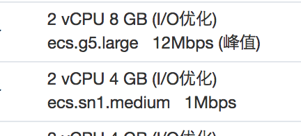

<!-- image url 
https://raw.githubusercontent.com/HealerJean123/HealerJean123.github.io/master/blogImages
　　首行缩进
<font color="red">  </font>
-->

## 前言


报错提示

```
Handler dispatch failed; nested exception is java.lang.OutOfMemoryError: Java heap space

```

## 1、以上报错很明显是java堆溢出

分析一下，上面的报错是测试环境中，测试环境的大小是2cpu 4G ，正式环境是2cpu 8G，正式环境可以生成很高质量的图片，但是测试环境却只能生成很小质量的图片。测试环境再生成高质量的图片的时候，就会抛出上面的异常信息。我们我们采用增大虚拟机内存的方式。




### 1.1、解决方法，因为我采用的是jar包的形式启动的。所以


```
#!/bin/bash
   echo starting
   Xmx表示虚拟机的堆区最大为2018，这个时候我给我了linux内存的一半，这样完美解决问题了
   java  -Xms256m -Xmx2018m    -jar admin-1.0-SNAPSHOT.jar --spring.profiles.active=prod > log.file 2>&1 &
~   
```


<br/><br/><br/>
如果满意，请打赏博主任意金额，感兴趣的在微信转账的时候，添加博主微信哦， 请下方留言吧。可与博主自由讨论哦

|支付包 | 微信|微信公众号|
|:-------:|:-------:|:------:|
| | ||


<!-- Gitalk 评论 start  -->

<link rel="stylesheet" href="https://unpkg.com/gitalk/dist/gitalk.css">
<script src="https://unpkg.com/gitalk@latest/dist/gitalk.min.js"></script> 
<div id="gitalk-container"></div>    
 <script type="text/javascript">
    var gitalk = new Gitalk({
		clientID: `1d164cd85549874d0e3a`,
		clientSecret: `527c3d223d1e6608953e835b547061037d140355`,
		repo: `HealerJean123.github.io`,
		owner: 'HealerJean123',
		admin: ['HealerJean123'],
		id: 'AAAAAAAAAAAAAA',
    });
    gitalk.render('gitalk-container');
</script> 

<!-- Gitalk end -->

