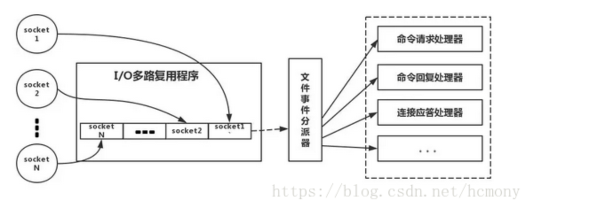

**前言**     

 Github：[https://github.com/HealerJean](https://github.com/HealerJean)         

 博客：[http://blog.healerjean.com](http://HealerJean.github.io)         

​     

##  1、为什么使用Redis

　　1、我们在碰到需要执行耗时特别久，且结果不频繁变动的SQL，就特别适合将运行结果放入缓存。这样，后面的请求就去缓存中读取，使得请求能够迅速响应。    

　　2、在大并发的情况下，所有的请求直接访问数据库，数据库会出现连接异常。这个时候，就需要使用redis做一个缓冲操作，让请求先访问到redis，而不是直接访问数据库。
     
## 2、单线程Redis为什么那么快     

1、纯内存操作    
2、单线程操作，避免了资源的竞争    
3、采用了非阻塞I/O多路复用机制

### 2.1、什么是I/O多路复用

来源于网络     

举例：小曲在S城开了一家快递店，负责同城快送服务。小曲因为资金限制，雇佣了一批快递员，然后小曲发现资金不够了，只够买一辆车送快递。   

经营方式1、    
客户每送来一份快递，小曲就让一个快递员盯着，然后快递员开车去送快递。慢慢的小曲就发现了这种经营方式存在下述问题     


经营方式2：    
小曲只雇佣一个快递员。然后呢，客户送来的快递，小曲按送达地点标注好，然后依次放在一个地方。最后，那个快递员依次的去取快递，一次拿一个，然后开着车去送快递，送好了就回来拿下一个快递。


对比：     
上面两种明显应该是第二种效率更高，类似于如下模型      

+ 每个快递员--------->每个线程
+ 每个快递----------->每个socket(I/O流)
+ 快递的送达地点------>socket的不同状态
+ 客户送快递请求------>来自客户端的请求
+ 小曲的经营方式---->服务端运行的代码
+ 一辆车--------->CPU的核数

结论：
1、经营方式一就是传统的并发模型，每个I/O流(快递)都有一个新的线程(快递员)管理。    
2、经营方式二就是I/O多路复用。只有单个线程(一个快递员)，通过跟踪每个I/O流的状态(每个快递的送达地点)，来管理多个I/O流。      


redis是通过socket访问到缓存服务,我们的redis-client在操作的时候，会产生具有不同事件类型的socket。**在服务端，有一段I/0多路复用程序**，将其置入队列之中。然后，文件事件分派器，依次去队列中取，转发到不同的事件处理器中。




## 3、如何应对缓存穿透和缓存雪崩问题

### 3.1、缓存穿透，即黑客故意去请求缓存中不存在的数据，导致所有的请求都怼到数据库上，从而数据库连接异常。

#### 方案1、使用互斥锁排队   

业界比价普遍的一种做法，即根据key获取value值为空时，锁上，从数据库中load数据后再释放锁。若其它线程获取锁失败，则等待一段时间后重试。这里要注意，分布式环境中要使用分布式锁，单机的话用普通的锁（synchronized、Lock）就够了。(因为这样大量查询无效key访问不是很多，如果大量查询的肯定放到缓存里面去了)   

如果没有获取到锁，就让他休息一段时间


```java

public String getWithLock(String key, Jedis jedis, String lockKey, String uniqueId, long expireTime) {
    // 通过key获取value
    String value = redisService.get(key);
    if (StringUtil.isEmpty(value)) {
        // 分布式锁，详细可以参考https://blog.csdn.net/fanrenxiang/article/details/79803037
        //封装的tryDistributedLock包括setnx和expire两个功能，在低版本的redis中不支持
        try {
            boolean locked = redisService.tryDistributedLock(jedis, lockKey, uniqueId, expireTime);
            if (locked) {
                value = userService.getById(key);
                redisService.set(key, value);
                redisService.del(lockKey);
                return value;
            } else {
                // 其它线程进来了没获取到锁便等待50ms后重试
                Thread.sleep(50);
                getWithLock(key, jedis, lockKey, uniqueId, expireTime);
            }
        } catch (Exception e) {
            log.error("getWithLock exception=" + e);
            return value;
        } finally {
            redisService.releaseDistributedLock(jedis, lockKey, uniqueId);
        }
    }
    return value;


```


#### 3.2、重要的接口一定要做好限流策略，防止用户恶意刷接口，同时要降级准备，当接口中的某些服务不可用时候，进行熔断，失败快速返回机制。

#### 3.3、布隆过滤器

bloomfilter就类似于一个hash set，用于快速判某个元素是否存在于集合中，其典型的应用场景就是快速判断一个key是否存在于某容器，不存在就直接返回。布隆过滤器的关键就在于hash算法和容器大小，下面先来简单的实现下看看效果，我这里用guava实现的布隆过滤器：


```xml


<dependencies>  
     <dependency>  
         <groupId>com.google.guava</groupId>  
         <artifactId>guava</artifactId>  
         <version>23.0</version>  
     </dependency>  
</dependencies> 

```


```java
public class BloomFilterTest {
 
    private static final int capacity = 1000000;
    private static final int key = 999998;
 
    private static BloomFilter<Integer> bloomFilter = BloomFilter.create(Funnels.integerFunnel(), capacity);
 
    static {
        for (int i = 0; i < capacity; i++) {
            bloomFilter.put(i);
        }
    }
 
    public static void main(String[] args) {
        /*返回计算机最精确的时间，单位微妙*/
        long start = System.nanoTime();
 
        if (bloomFilter.mightContain(key)) {
            System.out.println("成功过滤到" + key);
        }
        long end = System.nanoTime();
        System.out.println("布隆过滤器消耗时间:" + (end - start));
        int sum = 0;
        for (int i = capacity + 20000; i < capacity + 30000; i++) {
            if (bloomFilter.mightContain(i)) {
                sum = sum + 1;
            }
        }
        System.out.println("错判率为:" + sum);
    }
}


成功过滤到999998
布隆过滤器消耗时间:215518
错判率为:318

可以看到，100w个数据中只消耗了约0.2毫秒就匹配到了key，速度足够快。然后模拟了1w个不存在于布隆过滤器中的key，匹配错误率为318/10000，也就是说，出错率大概为3%，跟踪下BloomFilter的源码发现默认的容错率就是0.03：

public static <T> BloomFilter<T> create(Funnel<T> funnel, int expectedInsertions /* n */) {
  return create(funnel, expectedInsertions, 0.03); // FYI, for 3%, we always get 5 hash functions
}

```


### 3.2、缓存雪崩 即缓存同一时间大面积的失效，这个时候又来了一波请求，结果请求都怼到数据库上，从而导致数据库连接异常。

方案1、也是像解决缓存穿透一样加锁排队，实现同上;      

方案2、建立备份缓存，缓存A和缓存B，A设置超时时间，B不设值超时时间，先从A读缓存，A没有读B，并且异步启动一个更新线程，更新A缓存和B缓存;    

方案3、设置缓存超时时间的时候加上一个随机的时间长度，比如这个缓存key的超时时间是固定的5分钟加上随机的2分钟，酱紫可从一定程度上避免雪崩问题；


## 4、如何解决redis的并发竞争key问题


问题 ：这个问题大致就是，同时有多个子系统去set一个key。这个时候要注意什么呢？大家思考过么。需要说明一下，博主提前百度了一下，发现答案基本都是推荐用redis事务机制。博主不推荐使用redis的事务机制。因为我们的生产环境，基本都是redis集群环境，做了数据分片操作。你一个事务中有涉及到多个key操作的时候，这多个key不一定都存储在同一个redis-server上。因此，redis的事务机制，十分鸡肋。


### 4.1、分不是锁

### 4.2、乐观锁

如果对这个key操作，要求顺序
假设有一个key1,系统A需要将key1设置为valueA,系统B需要将key1设置为valueB,系统C需要将key1设置为valueC.
期望按照key1的value值按照 valueA-->valueB-->valueC的顺序变化。这种时候我们在数据写入数据库的时候，需要保存一个时间戳。假设时间戳如下
.......

```
系统A key 1 {valueA  3:00}
系统B key 1 {valueB  3:05}
系统C key 1 {valueC  3:10}


那么，假设这会系统B先抢到锁，将key1设置为{valueB 3:05}。接下来系统A抢到锁，发现自己的valueA的时间戳早于缓存中的时间戳，那就不做set操作了。以此类推。


```


​    


<!-- Gitalk 评论 start  -->

<link rel="stylesheet" href="https://unpkg.com/gitalk/dist/gitalk.css">
<script src="https://unpkg.com/gitalk@latest/dist/gitalk.min.js"></script> 
<div id="gitalk-container"></div>    
 <script type="text/javascript">
    var gitalk = new Gitalk({
		clientID: `1d164cd85549874d0e3a`,
		clientSecret: `527c3d223d1e6608953e835b547061037d140355`,
		repo: `HealerJean.github.io`,
		owner: 'HealerJean',
		admin: ['HealerJean'],
		id: 'skDRFNjJPyg5QiV4',
    });
    gitalk.render('gitalk-container');
</script> 

<!-- Gitalk end -->

