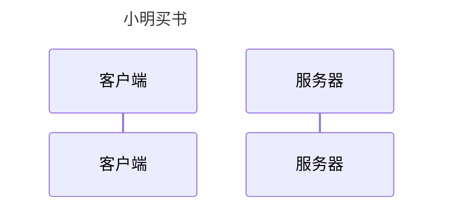
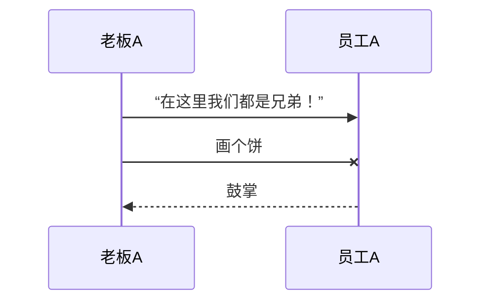
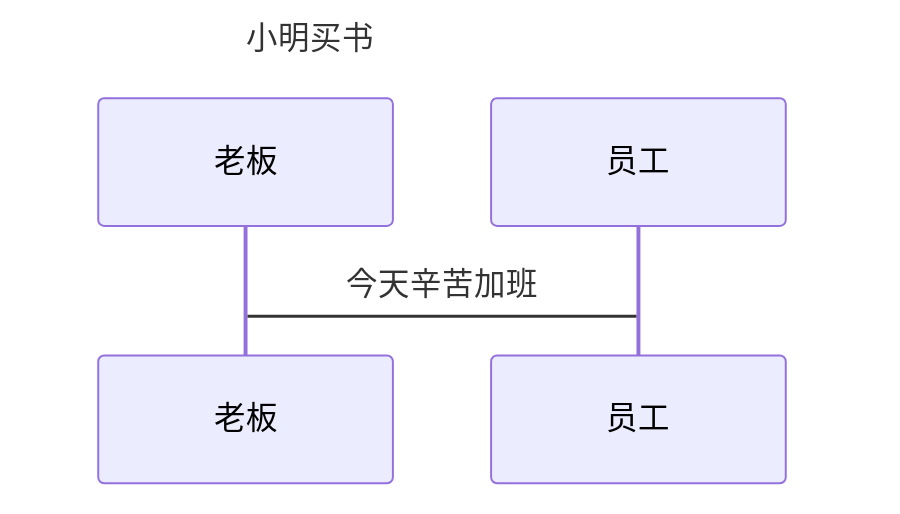
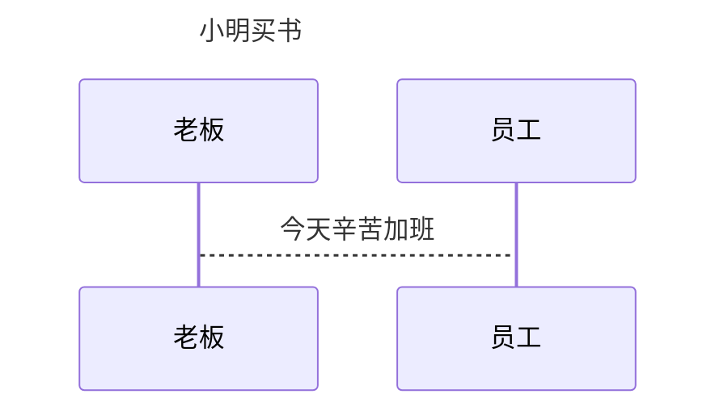
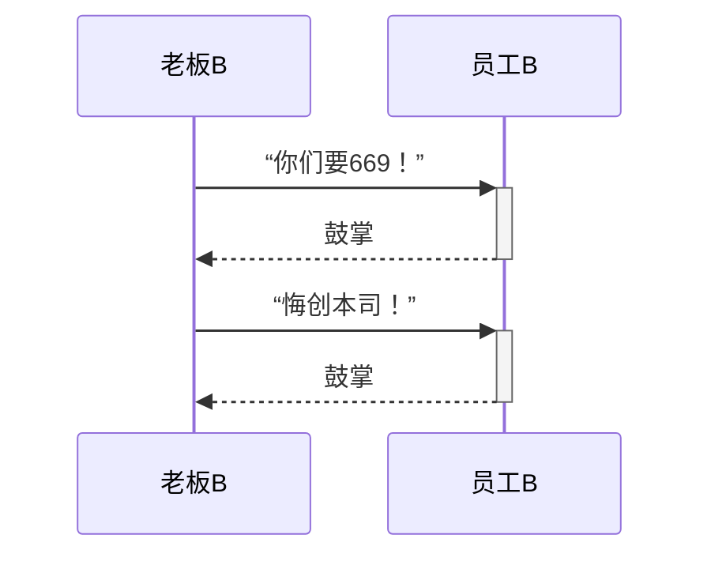
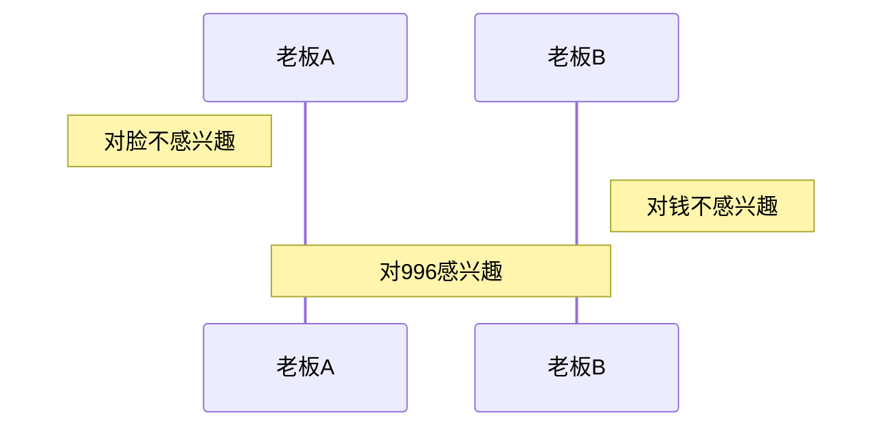
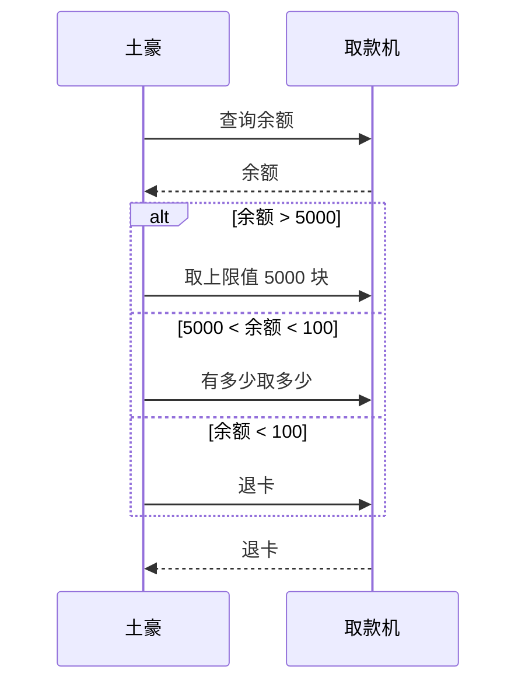
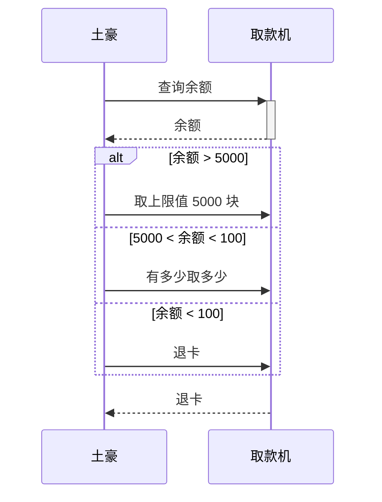
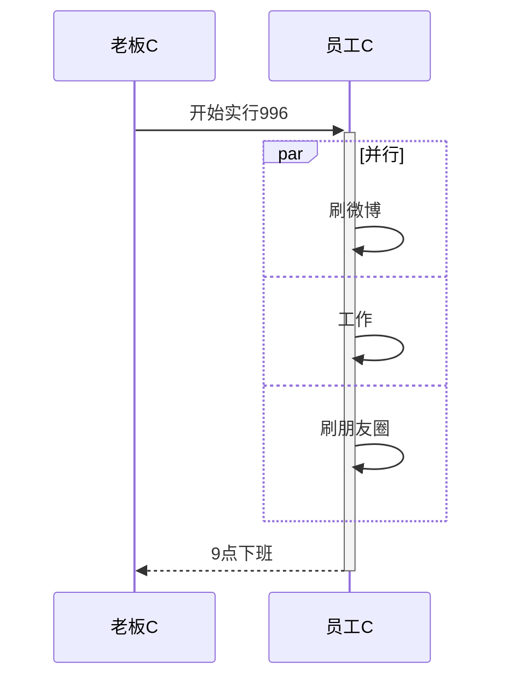
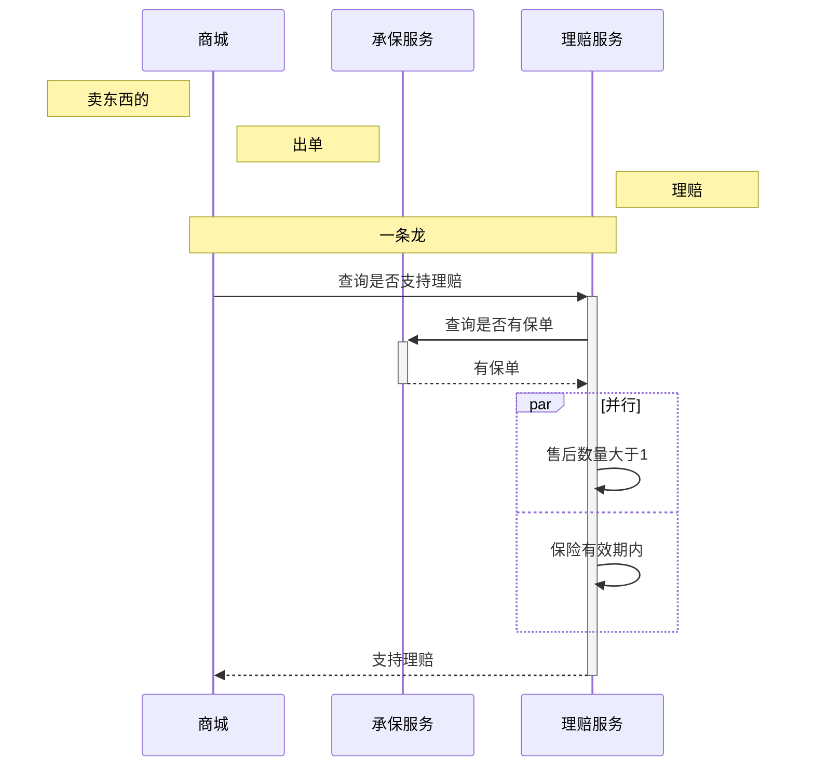

**前言**     

 Github：[https://github.com/HealerJean](https://github.com/HealerJean)         

 博客：[http://blog.healerjean.com](http://HealerJean.github.io)          


````
```mermaid
时序图代码
```
````


# 1、参与者

> 传统时序图概念中参与者有角色和类对象之分，但这里我们不做此区分，用参与者表示一切参与交互的事物，可以是人、类对象、系统等形式。中间竖直的线段从上至下表示时间的流逝。

````

````


# 2、消息

> 交互时一方对另一方的操作（比如接口调用）或传递出的信息。  消息语句格式为：`<参与者> <箭头> <参与者> : <描述文本>`。    
>
>  `<箭头>`的写法有：  

## 2.1、`->>` ：主动发出消息 实线带有箭头

>  `->>`  显示为实线箭头（主动发出消息）    


## 2.2、`-->>    `：响应 虚线带有箭头

> `-->>  `显示为虚线箭头（响应）    


## 2.3、 `-x ` ：异步消息

>  `-x ` 显示为末尾带「X」的实线箭头（异步消息）


````

````


## 2.4、`->`：没有箭头的实线

````

````


## 2.5、`-->`：没有监听的虚线

````

````


# 3、激活框 `+` `-`

> `participant <参与者名称>` 这句可以省略，省略后参与者横向排列的次序，由消息语句中其出现的次序决定。如后续示例所示。
>
> ⬤  画法如下，注意体会箭头符号后的 `+` 和 `-` 的使用方法和效果，它们相当于激活框的开关：

````

````


# 4、注解

> 看图就明白了

````

````


# 5、选择`alt`：（`if` `else`）

> 在多个条件中作出判断，每个条件将对应不同的消息序列。相当于 `if` 及`else` `if` 语句。


````

````




# 6、并行 `Par`

> 将消息序列分成多个片段，这些片段并行执行。

````

````


# 练习：

````

````


<!-- Gitalk 评论 start  -->

<link rel="stylesheet" href="https://unpkg.com/gitalk/dist/gitalk.css">

<script src="https://unpkg.com/gitalk@latest/dist/gitalk.min.js"></script> 
<div id="gitalk-container"></div>    
 <script type="text/javascript">
    var gitalk = new Gitalk({
		clientID: `1d164cd85549874d0e3a`,
		clientSecret: `527c3d223d1e6608953e835b547061037d140355`,
		repo: `HealerJean.github.io`,
		owner: 'HealerJean',
		admin: ['HealerJean'],
		id: 'bC3rTtZyd6iczSYI',
    });
    gitalk.render('gitalk-container');
</script> 


<!-- Gitalk end -->


