**前言**     

 Github：[https://github.com/HealerJean](https://github.com/HealerJean)         

 博客：[http://blog.healerjean.com](http://HealerJean.github.io)          


# 一、基础教程

## 1、流程图

### 2）节点与连接

```
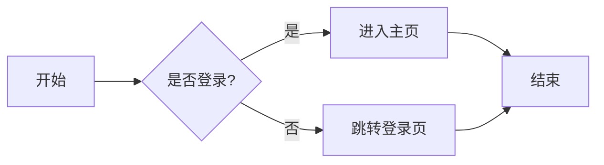


### 3）节点形状与样式

- `[]` 矩形（默认）
- `()` 圆角矩形
- `{}` 菱形（判断）
- `[[]]` 子程序
- `(( ))` 圆形
- `> ]` 梯形（输入/输出）

```
flowchart LR
    Start((开始)) --> Input[/输入数据/]
    Input --> Process[(处理)]
    Process --> Decision{成功?}
    Decision -->|是| Output[\输出结果\]
    Decision -->|否| Error[[错误处理]]
    Output --> End((结束))
    Error --> End
```


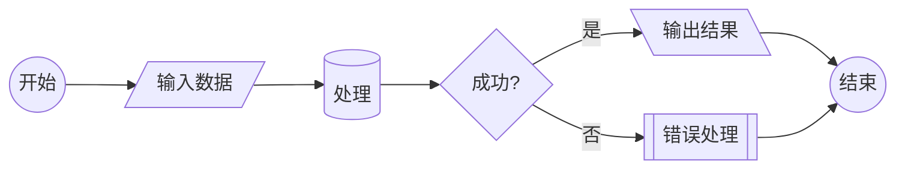


### 4）方向控制

支持 `LR`（从左到右）、`RL`（右到左）、`TB`（从上到下，默认）、`BT`（从下到上）：

```
flowchart TB
    A[用户] --> B(提交请求)
    B --> C{验证通过?}
    C -->|是| D[返回数据]
    C -->|否| E[返回错误]
```

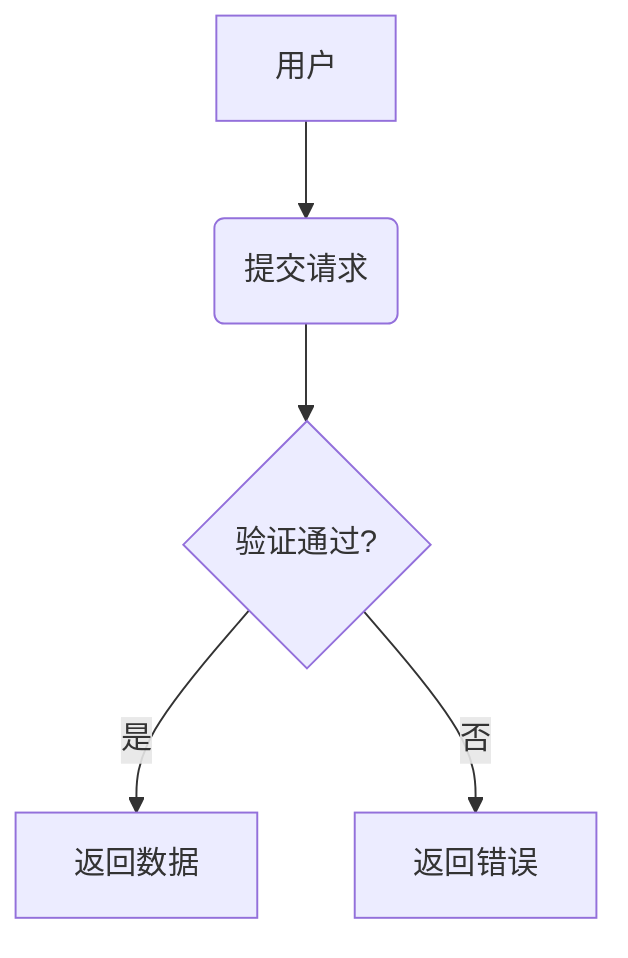


## 2、时序图（`Sequence Diagram`）

### 1）参与者声明

```
sequenceDiagram
    participant User as 用户
    participant Server as 服务端
    participant DB as 数据库

    User->>Server: 登录请求
    Server->>DB: 查询用户
    DB-->>Server: 返回结果
    Server-->>User: 登录成功
```

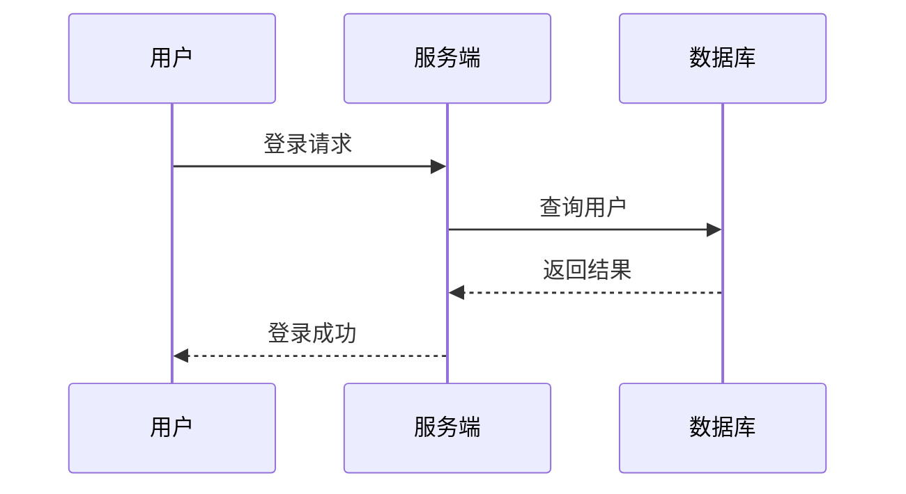


### 2）激活条（生命线）

> 用 `activate` 和 `deactivate` 控制生命线高亮：

```
sequenceDiagram
    participant A as 客户端
    participant B as API
    participant C as 数据库

    A->>B: 请求数据
    activate B
    B->>C: 查询
    activate C
    C-->>B: 返回
    deactivate C
    B-->>A: 响应
    deactivate B
```

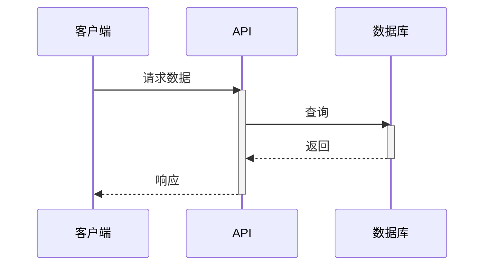


### 3）注释与组合

> 支持 `Note`、`alt/else`、`loop`、`par` 等：

```
sequenceDiagram
    participant User
    participant System

    User->>System: 输入金额
    alt 金额 > 0
        System-->>User: 处理成功
    else 金额 <= 0
        Note right of System: 无效金额
        System-->>User: 错误提示
    end

    loop 每日检查
        System->>System: 执行定时任务
    end
```

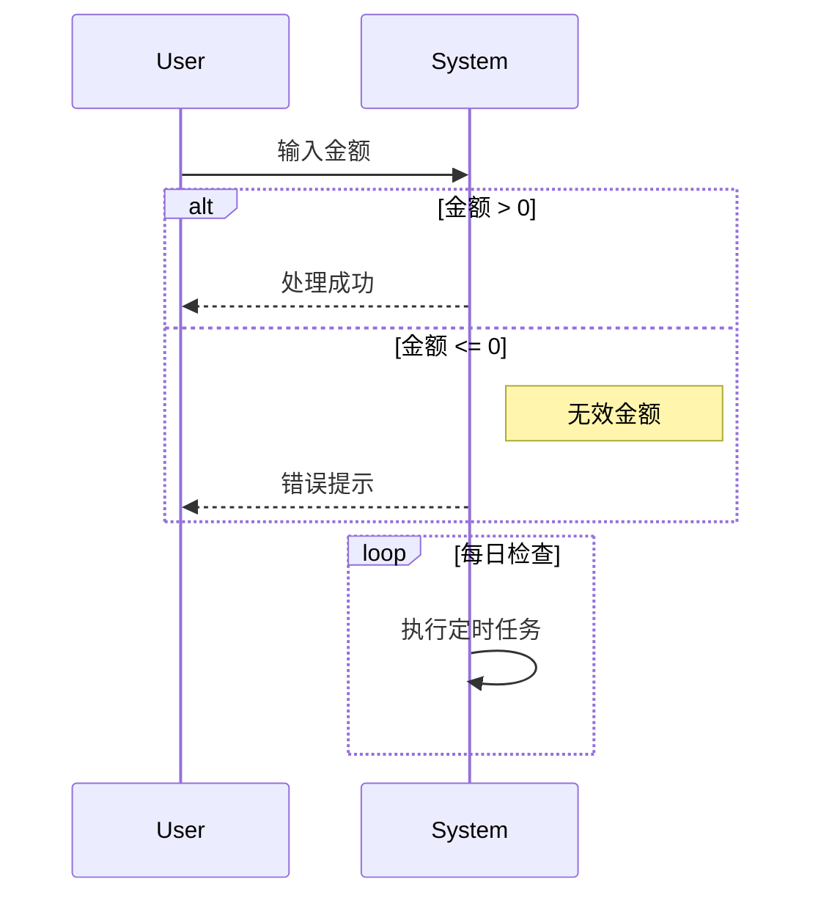


## 3、甘特图（Gantt Chart）

```sh
gantt
    title 项目计划
    dateFormat  YYYY-MM-DD
    section 需求阶段
    需求分析     :a1, 2025-04-01, 7d
    文档编写     :after a1, 3d

    section 开发阶段
    前端开发     :2025-04-10, 10d
    后端开发     :2025-04-12, 12d

    section 测试
    集成测试     :2025-04-22, 5d
```

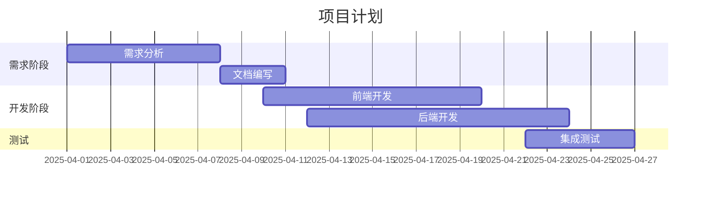


## 4、状态图（State Diagram）

```
stateDiagram-v2
    [*] --> 初始化
    初始化 --> 就绪: 启动完成
    就绪 --> 运行: 接收任务
    运行 --> 暂停: 用户暂停
    暂停 --> 运行: 用户恢复
    运行 --> 结束: 任务完成
    结束 --> [*]

```


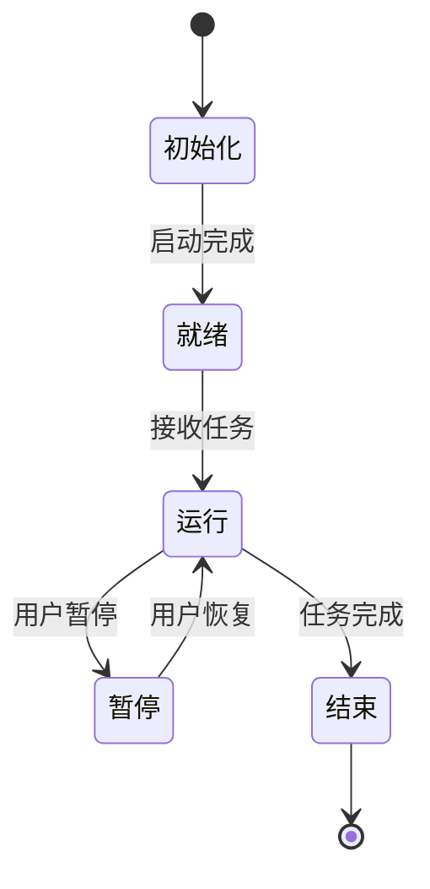


## 5、类图（Class Diagram）

```
classDiagram
    class Animal {
        +String name
        +int age
        +eat()
        +sleep()
    }

    class Dog {
        +bark()
    }

    class Cat {
        +meow()
    }

    Animal <|-- Dog
    Animal <|-- Cat

```

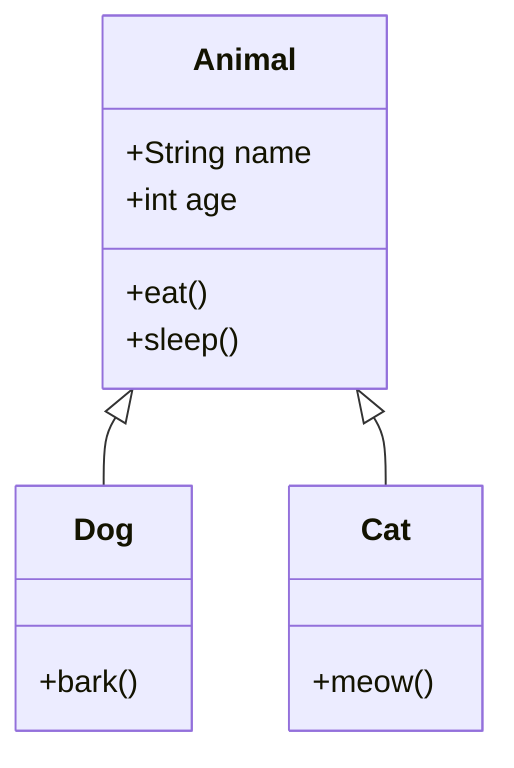


# 二、实战

## 1、用户登录流程（时序图 + 流程图结合）

```
sequenceDiagram
    actor 用户
    participant 前端
    participant 后端
    participant Redis

    用户->>前端: 输入账号密码
    前端->>后端: POST /login
    activate 后端
    后端->>Redis: 验证验证码（可选）
    Redis-->>后端: 验证结果
    后端->>后端: 校验密码 & 生成 Token
    后端-->>前端: { token: "xxx" }
    deactivate 后端
    前端->>用户: 跳转主页

```

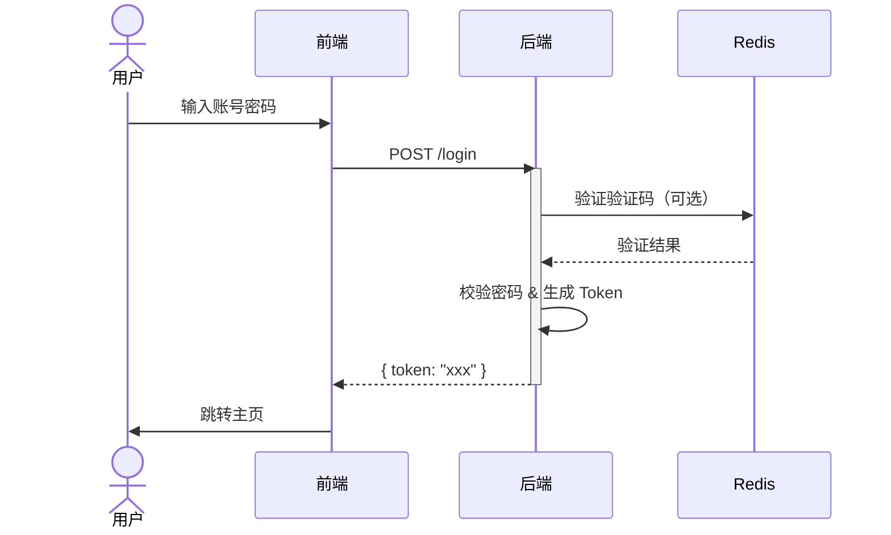


## 2、微服务调用链（流程图）

```
flowchart LR
    A[客户端] --> B(API Gateway)
    B --> C[用户服务]
    B --> D[订单服务]
    C --> E[(MySQL)]
    D --> F[(MongoDB)]
    D --> C

```

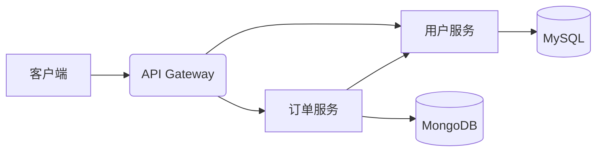


<!-- Gitalk 评论 start  -->

<link rel="stylesheet" href="https://unpkg.com/gitalk/dist/gitalk.css">

<script src="https://unpkg.com/gitalk@latest/dist/gitalk.min.js"></script> 
<div id="gitalk-container"></div>    
 <script type="text/javascript">
    var gitalk = new Gitalk({
		clientID: `1d164cd85549874d0e3a`,
		clientSecret: `527c3d223d1e6608953e835b547061037d140355`,
		repo: `HealerJean.github.io`,
		owner: 'HealerJean',
		admin: ['HealerJean'],
		id: 'uNAeyLBkEK3Dq5won8S9',
    });
    gitalk.render('gitalk-container');
</script> 


<!-- Gitalk end -->


